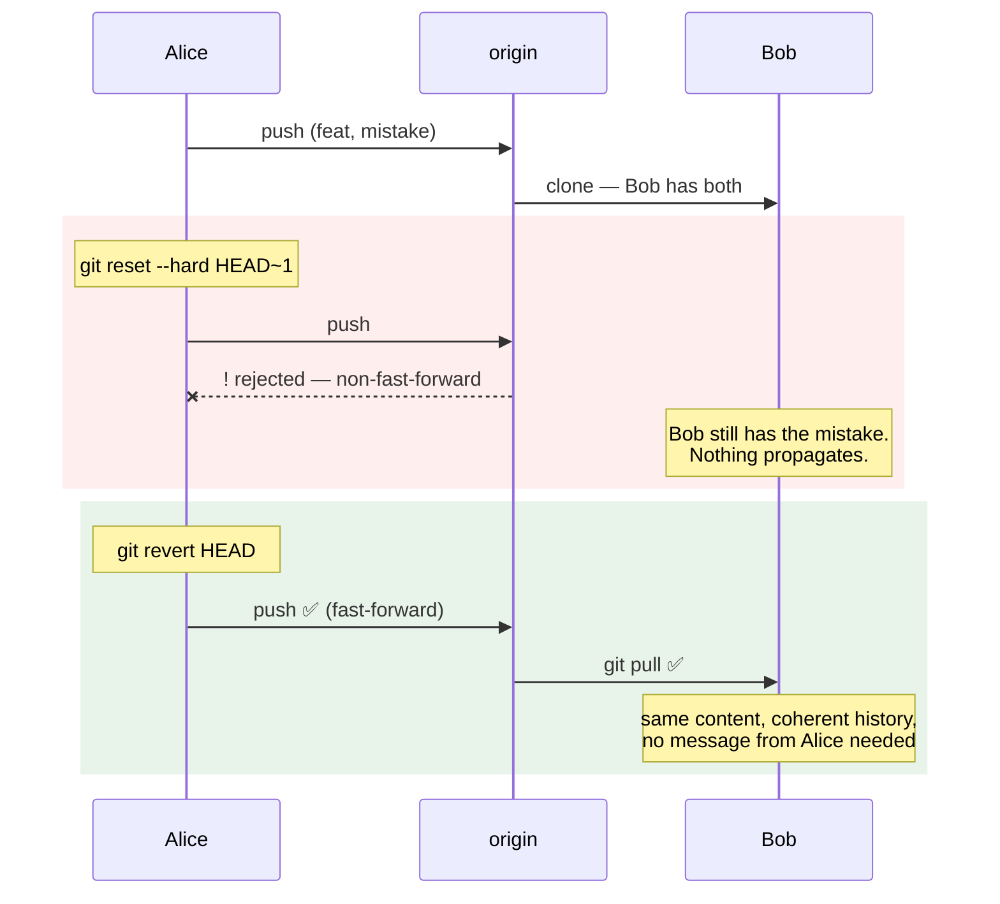

# 4.2 — `revert` versus `reset`: the only one that is safe on shared history

## One-line answer

`reset` changes what the history **says**; `revert` adds to it — and once a commit has left your machine, only
the second one is coherent, because everybody else's copy is evidence you no longer control.

---

## The story

🎬 **The scene.** A parish council that keeps minutes, and a decision recorded in March that turns out to have
been wrong.

There are two ways to deal with it, and the council's constitution names them.

**Rescission**: an April meeting resolves to rescind the March decision. The March minute stays exactly as it
was; the April minute says it is overturned and why. Anybody reading the book sees both, in order.

**Or**: somebody takes the March page out and retypes it.

😬 **The naive fix.** The second one. It is tidier, the outcome is the same, and the March decision was
genuinely a mistake.

💥 **Why it fails.** Fourteen people were sent copies of the March minutes. Their copies say the original
thing. **The book and the copies now disagree, and nothing in either says why** — so at the next meeting two
people argue from different documents and neither is wrong.

And a year later, an audit asks *"when did the council know about this?"* The book says it never happened. The
copies say otherwise. **The retyping did not undo the decision; it destroyed the ability to answer the
question.**

💡 **The insight.** **Once a record has been distributed, editing your copy does not edit theirs — it only
creates a disagreement.** The correction has to be a new entry, because a new entry is the only kind of change
that propagates.

---

## The idea in plain language

[4.1](4.1-the-four-undos.md) gave the decision rule in one question — *has anybody else got it* — and this part
is why the answer matters so much.

**`git reset` moves a branch pointer** ([1.3](../01-the-object-model/1.3-branches-and-head-are-just-pointers.md)).
After it, the branch means something different: the commits it used to include are still in the object
database and are no longer reachable from the branch
([1.4](../01-the-object-model/1.4-nothing-is-lost-the-object-database.md)).

**`git revert` computes the inverse of a commit and applies it as a new one.** After it, the branch includes
both the mistake and its correction.

The file contents end up identical. **The histories do not**, and the history is the shared object:

| | after `reset` | after `revert` |
| --- | --- | --- |
| what the files say | the old content | the old content |
| what the history says | it never happened | it happened, then was undone |
| commits reachable from the branch | fewer | more |
| what a colleague's clone thinks | **it disagrees** | it agrees, after a normal pull |
| can it be pushed normally? | **no** — needs `--force` | yes |
| can you answer "when did we ship the bug?" | no | yes |
| can you re-apply the change later? | you have to find it | `git revert` the revert |

**Rows four and five are the operational ones.** A `reset` on a shared branch cannot be pushed without
`--force`, and the moment you need `--force` you are about to change history other people have
([4.3](4.3-the-force-push-and-the-reflog.md)).

### Why "the files are the same" is the trap

It is genuinely true and it is why people choose `reset`: the deployed artifact would be identical either way.
The difference is entirely in what the record says — which is invisible until:

- somebody asks **when the bug shipped** (Day 82's postmortem timeline);
- somebody asks **what was in release 1.4.0** (Day 16's changelog);
- an auditor asks **who approved the change and when it was reverted** (Day 217);
- somebody wants to **re-apply** the change with a fix — which is `git revert` the revert, and is impossible if
  the commit is unreachable;
- or Day 10's release ledger references a commit that no branch reaches
  ([Day 10, 2.2](../../../day-010-environments-and-promotion/parts/02-promotion/2.2-build-release-run.md)).

**Every one of those is a question about the past**, and `reset` is the operation that answers "it never
happened".

### Reverting a revert

A property people do not expect and which is worth knowing before you need it: **a revert is an ordinary
commit**, so it can be reverted.

That is the standard workflow for *"undo it now, fix it properly next week"*: revert during the incident, then
revert the revert on the branch where you are fixing it, so the original change comes back and you build on
top of it. **No cherry-picking, no re-typing, no lost authorship.**

### The one that has a flag

Reverting a **merge** commit needs `-m <parent-number>`, because a merge has two parents and "the inverse"
is ambiguous ([4.1](4.1-the-four-undos.md) met the error). `-m 1` means "undo relative to the first parent",
which is the branch you merged into.

**And it has a consequence people meet once:** git now considers that branch merged-and-undone, so merging it
again brings in nothing. To genuinely re-apply it you revert the revert first.

---

## Why Kriya needs it

**[4.3](4.3-the-force-push-and-the-reflog.md)** is what `reset` on a shared branch actually costs.

**Day 12** writes the rule down for this project: which branches are shared, and therefore where `reset` is
forbidden.

**Day 19's rollback** is `revert` at the level of a release — an undo that goes forward, is recorded, and
leaves the ledger coherent.

**Day 10's release ledger** is append-only by design
([Day 10, 2.2](../../../day-010-environments-and-promotion/parts/02-promotion/2.2-build-release-run.md)), for
the same reason and with the same argument: *a release cannot be mutated once it is created.*

**Day 82's postmortem** needs a timeline, and **Day 217's auditability** needs to answer "what changed and
when" months later. Both are queries against a history that has to still contain the mistake.

---

## The mechanism

Two branches, the same mistake, the two undos — and then look at what a *third party* sees. **Scratch
repository, with a real remote**, because "shared" is the whole subject and cannot be demonstrated without
one.

```bash
BASE=$(mktemp -d)
git init -q --bare "$BASE/origin.git"
git clone -q "$BASE/origin.git" "$BASE/alice" && cd "$BASE/alice"
git config user.email alice@example.invalid && git config user.name Alice
printf 'TIMEOUT = 1.0\n' > client.py
git add client.py && git commit -q -m "feat: add the client"
printf 'TIMEOUT = 999.0\n' > client.py
git commit -q -am "fix: set the timeout to 999 (the mistake)"
git push -q -u origin main
git log --oneline
```

**Line by line:**

- `git init --bare` creates a repository with **no working tree** — just the object database and refs. That is
  what a server-side repository is, and cloning from a path on the same machine is a complete, honest model of
  a remote.
- `git clone` gives Alice a working copy with `origin` already configured.
- Two commits, the second of which is the mistake, and **both pushed** — so they are now shared.
- `-u origin main` sets the upstream so later `git push` and `git status` know what to compare against.

```text
4e9c0b3 fix: set the timeout to 999 (the mistake)
8a1f5d7 feat: add the client
```

**A second person clones it** — this is the copy that makes it shared:

```bash
git clone -q "$BASE/origin.git" "$BASE/bob" && cd "$BASE/bob"
git config user.email bob@example.invalid && git config user.name Bob
git log --oneline
cat client.py
```

**Line by line:**

- Bob's clone has both commits. **This is the fourteen copies of the March minutes.**

```text
4e9c0b3 fix: set the timeout to 999 (the mistake)
8a1f5d7 feat: add the client
TIMEOUT = 999.0
```

**Alice tries `reset`:**

```bash
cd "$BASE/alice"
git reset --hard HEAD~1
git log --oneline
git push 2>&1 | tail -4
```

**Line by line:**

- The reset works locally and instantly. `git log` shows one commit; the file is back to `1.0`.
- **The push is where it stops.** The remote's `main` points at a commit that is no longer an ancestor of
  Alice's, so the update is not a fast-forward
  ([1.3](../01-the-object-model/1.3-branches-and-head-are-just-pointers.md)).

```text
8a1f5d7 feat: add the client
 ! [rejected]        main -> main (non-fast-forward)
error: failed to push some refs to '/tmp/.../origin.git'
hint: Updates were rejected because the tip of your current branch is behind
hint: its remote counterpart. If you want to integrate the remote changes, use
hint: 'git pull' before pushing again.
```

**The refusal is git protecting Bob.** Getting past it requires `--force`, and
[4.3](4.3-the-force-push-and-the-reflog.md) is what happens then.

**Now the correct undo:**

```bash
cd "$BASE/alice"
git reset --hard origin/main          # put Alice back in sync first
git log --oneline
git revert --no-edit HEAD
git push -q
git log --oneline
cat client.py
```

**Line by line:**

- `git reset --hard origin/main` — **reset to the remote's position**, undoing Alice's local reset. `origin/main`
  is a remote-tracking ref: a local pointer recording where the remote's branch was at the last fetch.
- `git revert --no-edit HEAD` creates the inverse commit.
- `git push` **succeeds with no flags**, because the new commit is a descendant of what the remote has — a
  fast-forward.

```text
4e9c0b3 fix: set the timeout to 999 (the mistake)
8a1f5d7 feat: add the client
b7d2f1a Revert "fix: set the timeout to 999 (the mistake)"
4e9c0b3 fix: set the timeout to 999 (the mistake)
8a1f5d7 feat: add the client
TIMEOUT = 1.0
```

**And what Bob sees:**

```bash
cd "$BASE/bob"
git pull -q
git log --oneline
cat client.py
git status --short --branch
```

**Line by line:**

- An ordinary `git pull` — **no conflict, no confusion, no message from Alice required.**
- Bob's file content is now `1.0`, matching Alice's, and his history contains both the mistake and the
  correction.
- `git status --short --branch` prints the branch line showing his relationship to the remote.

```text
b7d2f1a Revert "fix: set the timeout to 999 (the mistake)"
4e9c0b3 fix: set the timeout to 999 (the mistake)
8a1f5d7 feat: add the client
TIMEOUT = 1.0
## main...origin/main
```

**Identical content, coherent history, nobody had to do anything.** That is the whole argument.

### Answering the questions afterwards

The payoff — the questions `reset` would have made unanswerable:

```bash
cd "$BASE/bob"
echo '--- when did the bug ship, and when was it undone? ---'
git log --format='%h %ad %s' --date=short
echo '--- what exactly did the revert undo? ---'
git show --format='%s' --stat b7d2f1a | head -5
echo '--- and can we bring the change back later? ---'
git revert --no-edit b7d2f1a && cat client.py && git log --oneline -1
```

**Line by line:**

- The first query is the postmortem timeline: **two dated entries, in order** (Day 82).
- `git show --stat <revert>` shows what the revert changed — which is the inverse of the original.
- **`git revert` on the revert brings the change back**, with authorship and history intact. It is the "undo
  now, fix properly later" workflow, in one command.

```text
--- when did the bug ship, and when was it undone? ---
b7d2f1a 2026-08-25 Revert "fix: set the timeout to 999 (the mistake)"
4e9c0b3 2026-08-25 fix: set the timeout to 999 (the mistake)
8a1f5d7 2026-08-25 feat: add the client
--- what exactly did the revert undo? ---
Revert "fix: set the timeout to 999 (the mistake)"
 client.py | 2 +-
--- and can we bring the change back later? ---
TIMEOUT = 999.0
2c9f0e4 Revert "Revert \"fix: set the timeout to 999 (the mistake)\""
```

**Four commits, and the full story is readable from the log.** Compare with the `reset` version, whose log
says one commit and answers nothing.

### The merge revert

```bash
cd "$BASE/alice"
git pull -q
git switch -q -c feature
printf 'FEATURE = True\n' >> client.py
git commit -q -am "feat: add the feature"
git switch -q main
git merge -q --no-ff feature -m "Merge branch 'feature'"
MERGE=$(git rev-parse --short HEAD)
git log --oneline -2
echo '--- reverting a merge without -m ---'
git revert --no-edit "$MERGE" 2>&1 | tail -2
echo '--- with -m 1 ---'
git revert --no-edit -m 1 "$MERGE" | tail -1
cat client.py
```

**Line by line:**

- `--no-ff` forces a real merge commit even though a fast-forward was possible — **so there is a two-parent
  commit to revert.**
- The first `git revert` fails with the ambiguity error from [4.1](4.1-the-four-undos.md).
- `-m 1` selects the **first parent** — the branch you were on when you merged, i.e. `main`. `-m 2` would undo
  relative to the feature branch, which is almost never what you want.

```text
1a7e3c8 Merge branch 'feature'
9f0b2d5 feat: add the feature
--- reverting a merge without -m ---
error: commit 1a7e3c8 is a merge but no -m option was given.
fatal: revert failed
--- with -m 1 ---
[main 6d4a1f9] Revert "Merge branch 'feature'"
TIMEOUT = 999.0
```

Clean up:

```bash
cd /tmp && rm -rf "$BASE"
```

**Line by line:**

- One temporary base directory holding the bare remote and both clones, removed together.



---

## When it breaks

**The `reset` that was force-pushed anyway.** The refusal, defeated:

```text
$ git push --force
 + 4e9c0b3...8a1f5d7 main -> main (forced update)
$ # ...and Bob, next morning:
$ git pull
warning: fetch updated the current branch head.
fatal: refusing to merge unrelated histories
```

**What it says:** Bob cannot pull.
**What it actually means:** Alice rewrote the branch. Bob's local `main` contains a commit the remote no
longer has, so his next pull is a merge of two divergent histories — and if he resolves it the "wrong" way,
**he pushes the mistake back**, which is the outcome nobody predicts.
**The smallest fix:** Alice reverts her force-push (the reflog has the old position) and does it properly.
**Why the resurrection is the surprising part:** everybody assumes the risk of a force-push is losing work.
The equally common outcome is *un-losing* it — the removed commit comes back through somebody else's clone,
hours later, in a merge nobody reviewed. [4.3](4.3-the-force-push-and-the-reflog.md) is the full version.

**The revert that could not be re-applied.** The merge consequence:

```text
$ git merge feature
Already up to date.
$ # ...but the feature is not in the code
```

**What it says:** nothing to merge.
**What it actually means:** the merge commit was reverted with `-m 1`, so git considers `feature` already
merged — the commits *are* reachable — and the revert that undid their effect is a separate, later commit.
**Merging again brings in nothing because there is nothing new to bring.**
**The smallest fix:** `git revert <the-revert-of-the-merge>` to restore the effect, then continue on the
branch.
**Why this catches everybody once:** "merge, revert, merge again" is the obvious sequence and it silently does
nothing. The error is not an error; it is `Already up to date.`

**The revert with an empty message.** The generated text, accepted:

```text
$ git log --oneline -1
b7d2f1a Revert "fix: set the timeout to 999 (the mistake)"
$ git log -1 --format='%b'
This reverts commit 4e9c0b3f1a2d.
```

**What it says:** what was reverted.
**What it actually means:** it does not say **why** — was the change wrong, or was it right and badly timed, or
did it expose a different bug? **The next person to look at this has to guess whether re-applying it is
sensible.**
**The smallest fix:** drop `--no-edit` and write two sentences: what the symptom was, and whether the change
should come back.
**Why this matters more for a revert than for an ordinary commit:** a revert is almost always made during an
incident, which is exactly when context is most valuable and least likely to be recorded
([2.1](../02-the-message/2.1-what-a-commit-message-is-for.md)).

**The revert that conflicted.** The case that is not automatic:

```text
$ git revert a91f0c2
error: could not revert a91f0c2... fix: raise the timeout
hint: After resolving the conflicts, mark them with
hint: "git add/rm <pathspec>", then run "git revert --continue".
```

**What it says:** a conflict.
**What it actually means:** later commits touched the same lines, so the inverse diff does not apply cleanly.
**A revert is a normal patch application and can conflict like any other.**
**The smallest fix:** resolve, `git add`, `git revert --continue` — or `git revert --abort` to back out
entirely.
**Why it is worth expecting:** people treat `revert` as a magic undo and are surprised when it needs a
decision. The older the commit being reverted, the more likely it conflicts — which is an argument for
reverting **quickly** during an incident rather than after investigating.

---

## In production

**What a professional writes instead of the teaching version.** The rule is mechanical and not
case-by-case: **once pushed, only `revert`** — enforced by a protected branch on the server so nobody has to
remember. During an incident they revert *first* and investigate afterwards, because a revert gets harder as
more commits land on top of it. And the revert's message is written properly even at 3am, with two sentences:
what the symptom was, and whether the change should return.

**What degrades at scale.** The number of copies, which makes the shared-or-not question always answer "yes".
Forks, mirrors, CI caches, an artifact built from the commit, a deployment record referencing it
([Day 10, 2.2](../../../day-010-environments-and-promotion/parts/02-promotion/2.2-build-release-run.md)) —
by the time a change has been through a pipeline, "nobody has it" is never true. Mature teams stop asking and
adopt the rule outright, and the loss is negligible: `revert` produces the same files.

**The failure that only shows with real traffic.** A revert applied to code that has changed underneath it.
Two weeks after the original, three commits have touched the same region, so the inverse diff conflicts and
somebody resolves it under incident pressure — **producing a state that is neither the old behaviour nor the
new one.** The defence is to revert quickly, and, when it is too late for that, to write a forward fix
deliberately rather than resolving a stale revert conflict at 3am.

**The review comment a senior engineer leaves.** *"This reverts the merge with `-m 1`, which is right — but
please add a note that we will need to revert this revert before re-merging the branch, or the next person
will run `git merge feature`, see 'Already up to date', and spend an hour on it. And the message needs to say
why: was the feature wrong, or was it fine and the migration was missing?"*

**The signal you would alert on.** Two, and both are about the *rate* rather than any individual event:
**revert commits per week** — a rising rate is Day 20's change failure rate showing up in the history, and it
is computable with `git log --grep='^Revert'`; and **any non-fast-forward update to a protected branch**, which
should be refused rather than alerted on and, if it somehow happens, is a security-relevant event worth paging
(Day 217). You would **not** alert on an individual revert: a revert is the system working, and the
alertable thing is how often it is needed.

**Blast radius.** This part creates a bare repository and two clones under `mktemp -d`, pushes between them,
and runs `reset --hard`, `revert` and a rejected `push` — **the first part of this day to involve a remote at
all.** Nothing touches the Kriya repository and no network is used: the "remote" is a directory on this
machine. Worst case: the temporary base directory survives. **The capability being taught has a genuinely
large real-world blast radius** — a `reset` plus force-push on a shared branch can destroy other people's
work, and this part deliberately stops at the rejection so that
[4.3](4.3-the-force-push-and-the-reflog.md) can show the consequence with the recovery attached. Who can
trigger it: anybody with push access, which is why the real bound is a server-side protected-branch rule.

**Cost.** `0` model calls, `0` tokens, `0` CI minutes, `0` new packages, `0` network (the remote is a local
path), `0` servers. Disk: three small repositories, deleted. RAM: negligible.

**The interview question.** *"When would you use `reset` instead of `revert`?"* The answer that shows the line:
*"Only when nothing has left my machine. `reset` moves the branch pointer, so the history stops containing the
commit — which is fine on an unpushed branch and incoherent once anybody else has a copy, because their clone
still has it and now disagrees with the remote. `revert` adds a new commit containing the inverse: same file
contents, and the history still says the change happened and was undone. The reason I care about the record
rather than the files is that every interesting question afterwards is about the past — when did the bug ship,
what was in that release, can we re-apply the change with a fix — and `reset` answers all of those with 'it
never happened'. In practice, on anything shared I do not make the judgement at all: once it is pushed, only
revert, enforced by a protected branch so nobody has to remember at 3am."*

---

## Check yourself

```bash
B=$(mktemp -d); git init -q --bare "$B/o.git"
git clone -q "$B/o.git" "$B/a" && cd "$B/a"
git config user.email a@example.invalid && git config user.name A
printf '1\n' > f && git add f && git commit -q -m one && git push -q -u origin main
printf '2\n' > f && git commit -q -am "two (mistake)" && git push -q
git reset --hard HEAD~1 && git push 2>&1 | grep -c 'rejected'
git reset --hard origin/main && git revert --no-edit HEAD && git push -q && git log --oneline
cd /tmp && rm -rf "$B"
```

A push that is **rejected** after a reset, and one that **succeeds** after a revert — from the same starting
mistake.

**Say out loud, without scrolling up:** *State what each of `reset` and `revert` does to the history, name
three questions that only a reverted history can answer, and explain why merging a branch again after
reverting its merge commit brings in nothing.*
