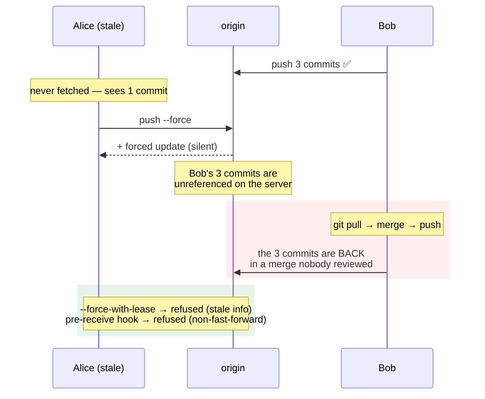

# 4.3 — The force-push that erased an afternoon

## One-line answer

`git push --force` moves a branch on the server to a commit that is not a descendant of what was there — so
anything only that branch pointed at becomes unreferenced on the server, and **the only copies left are in the
reflogs of whoever happened to have fetched it**, which is not a recovery plan.

---

## The story

🎬 **The scene.** A shared allotment with a communal noticeboard, and a rota pinned to it.

Somebody adds their name for Saturday. Somebody else adds two more names underneath. A fourth person, who
printed the rota this morning before those three additions, notices it is out of date, prints a fresh copy
from their own file, and pins it up.

😬 **The naive fix.** Replacing the board with the version you have, because yours is neatly printed and the
board had handwriting all over it.

💥 **Why it fails.** The three additions are gone, and — this is the part that makes it bad rather than
annoying — **nobody can tell.** The new rota looks correct and complete. The three people believe they are on
it. Saturday comes and nobody turns up, and the investigation is *"but I definitely wrote my name"* against a
board that has never had it.

The only surviving evidence is in one person's phone, where they happened to photograph the board on Thursday.

💡 **The insight.** **Replacing a shared record with your copy destroys everything that was added to it since
you took your copy, and leaves no trace that anything is missing.** The failure is silent, which is what makes
it worse than an error.

---

## The idea in plain language

[4.2](4.2-revert-versus-reset.md) ended with git refusing a push:

```text
 ! [rejected]        main -> main (non-fast-forward)
```

**That refusal is the safety mechanism.** A push is accepted when the new commit is a **descendant** of what
the server has — a *fast-forward*, which can only add. Anything else means the branch would stop containing
commits it currently contains, and git will not do that unless you insist.

`--force` insists.

### What is actually lost

Nothing is deleted from the object database immediately
([1.4](../01-the-object-model/1.4-nothing-is-lost-the-object-database.md)) — the commits become **unreferenced
on the server**. That distinction sounds reassuring and mostly is not:

| Where the commits still are | How long | Can you get them back? |
| --- | --- | --- |
| the server's object database | until its garbage collection runs | **not by you** — you do not control it |
| **your** reflog, if you did the force-push | 30–90 days | **yes**, and this is the usual recovery |
| a colleague's clone, if they fetched | until their `gc` | yes, if they still have it and you ask in time |
| a CI runner's cache | hours | usually no |

**Row two is the recovery**, and it only exists if the person who force-pushed still has the reflog entry —
which is why the first thing to do after a bad force-push is **stop and look**, not experiment.

### The two failure directions

**Direction one — work disappears.** Somebody pushed to the branch between your fetch and your push. Your
force-push replaces the branch with your version, and their commits are no longer on it.

**Direction two — work reappears.** This is the one nobody predicts. A colleague whose clone still has the
removed commits does a `git pull`, which is a **fetch plus a merge**. Git merges their history with the new
remote history, they resolve it, and they push. **The commits you removed are back**, in a merge nobody
reviewed, hours later.

That second direction is why force-pushing to remove a leaked credential does not work
([5.2](../05-repo-as-memory/5.2-the-secret-that-reached-history.md)): every clone is a copy that can put it
back.

### `--force-with-lease`

`git push --force-with-lease` refuses if the remote branch has moved since your last fetch. It converts
"overwrite whatever is there" into "overwrite what I last saw" — so **direction one** becomes a refusal
instead of a loss.

It is strictly better than `--force` and it is not a complete defence: a fetch (including one your editor or a
background process ran) updates the lease, so the check can be satisfied without you having *seen* the change.
Use it anyway; it is one flag and it turns most of these incidents into an error message.

### When force-pushing is legitimate

It is a normal, correct operation in exactly one situation: **a branch only you are working on**, being
cleaned up before review — squashing, reordering, rewriting messages, rebasing onto an updated base
([2.4](../02-the-message/2.4-one-change-per-commit.md)'s *messy while working, clean before review*).

**The rule that makes that safe is social and mechanical**: shared branches are protected on the server, so
the question never has to be answered under pressure.

---

## Why Kriya needs it

**[5.2](../05-repo-as-memory/5.2-the-secret-that-reached-history.md)** is the case where people reach for a
force-push for the wrong reason, and it is today's deliberate failure.

**Day 12** writes down which branches are protected for this project — the mechanical version of the rule.

**Day 19's rollback** is the safe alternative, at the deployment level.

**Day 10's release ledger** references commits by hash
([Day 10, 2.2](../../../day-010-environments-and-promotion/parts/02-promotion/2.2-build-release-run.md)); a
force-push that makes a referenced commit unreachable turns a promotion record into a dangling pointer, which
is Day 55's drift problem arriving from an unexpected direction.

**Day 217's auditability** requires that history is not silently editable, and **Day 216's supply chain** work
is what makes it provably so — signed commits over a chain of hashes
([1.1](../01-the-object-model/1.1-a-commit-is-a-snapshot-with-a-parent.md)).

---

## The mechanism

Cause both failure directions, then recover. **A bare remote and two clones under a temporary directory**, as
in [4.2](4.2-revert-versus-reset.md).

```bash
BASE=$(mktemp -d)
git init -q --bare "$BASE/origin.git"
git clone -q "$BASE/origin.git" "$BASE/alice" && cd "$BASE/alice"
git config user.email alice@example.invalid && git config user.name Alice
printf 'line 1\n' > shared.txt
git add shared.txt && git commit -q -m "feat: start the file"
git push -q -u origin main

git clone -q "$BASE/origin.git" "$BASE/bob" && cd "$BASE/bob"
git config user.email bob@example.invalid && git config user.name Bob

refs() { printf '%-10s %s\n' "$1" "$(git --git-dir="$BASE/origin.git" log --oneline main | tr '\n' ' ')"; }
refs "origin"
```

**Line by line:**

- `git --git-dir=<path> log` runs a command **against another repository** without changing directory. It is
  how you inspect the server's view, and it is the command that makes this demonstration possible.
- `refs()` prints the remote's branch as one line, so each step's effect on **the shared record** is visible.

```text
origin     8a1f5d7 feat: start the file
```

**Bob does an afternoon's work and pushes it:**

```bash
cd "$BASE/bob"
git pull -q
for n in 2 3 4; do printf 'line %s\n' "$n" >> shared.txt; git commit -q -am "feat: add line $n"; done
git push -q
refs "origin"
```

**Line by line:**

- Three commits — **the afternoon.** Ordinary work, pushed normally, now the shared truth.

```text
origin     c4e9b02 feat: add line 4 3f1a8d6 feat: add line 3 9b2c7e4 feat: add line 2 8a1f5d7 feat: start the file
```

**Alice, who has not fetched, rewrites her local history and forces it:**

```bash
cd "$BASE/alice"
git log --oneline
printf 'line 1 (reworded)\n' > shared.txt
git commit -q --amend -m "feat: start the file (better message)"
git log --oneline
git push --force
refs "origin"
```

**Line by line:**

- Alice's `git log` shows **one commit** — she has not fetched, so she does not know about Bob's three.
- `git commit --amend` creates a **new commit** replacing hers
  ([1.1](../01-the-object-model/1.1-a-commit-is-a-snapshot-with-a-parent.md)) — a completely reasonable thing
  to do to an unshared commit, and hers *was* shared.
- `git push --force` succeeds silently.
- **`refs "origin"` after the push is the whole demonstration.**

```text
8a1f5d7 feat: start the file
2d7f0a9 feat: start the file (better message)
 + 8a1f5d7...2d7f0a9 main -> main (forced update)
origin     2d7f0a9 feat: start the file (better message)
```

**One commit on the server.** Bob's three are gone from `main` — and note what git printed: `+` and
`(forced update)` in a line most people scroll past. **There was no warning, no confirmation, and no error.**

### Direction two: they come back

```bash
cd "$BASE/bob"
git log --oneline | head -2
git pull --no-rebase 2>&1 | tail -3
git log --oneline | head -3
git push -q
refs "origin"
```

**Line by line:**

- Bob's clone **still has his three commits** — nothing was removed from his machine.
- `git pull --no-rebase` fetches and **merges**. `--no-rebase` is explicit because the default depends on
  configuration, and the merge is the behaviour being demonstrated.
- His merge combines his history with Alice's rewritten one, and pushing it **puts his commits back on the
  server**.

```text
c4e9b02 feat: add line 4
3f1a8d6 feat: add line 3
Merge made by the 'ort' strategy.
7e0b3c1 Merge branch 'main' of /tmp/.../origin.git
c4e9b02 feat: add line 4
2d7f0a9 feat: start the file (better message)
origin     7e0b3c1 Merge ... c4e9b02 feat: add line 4 ... 2d7f0a9 feat: start the file (better message)
```

**The history now contains both**, joined by a merge nobody reviewed, and Alice's tidy-up achieved nothing
except a merge commit. **If the force-push had been an attempt to remove something, it is now back.**

### Recovering direction one

Reset the demonstration and do the recovery properly:

```bash
cd "$BASE/alice"
git fetch -q
git reflog -3
echo '--- what the remote had before the force-push ---'
git log --oneline "origin/main@{1}" 2>/dev/null | head -3 || echo "(no remote-tracking reflog entry)"
```

**Line by line:**

- **`origin/main@{1}`** — remote-tracking refs have reflogs too. This is *"where I last saw the remote's main
  before the most recent update"*, and it is the fastest recovery when you force-pushed over somebody else's
  work **and had fetched at some point**.
- `2>/dev/null || echo …` because the entry may not exist — Alice never fetched before forcing, which is
  exactly why she did not know.

```text
2d7f0a9 HEAD@{0}: commit (amend): feat: start the file (better message)
8a1f5d7 HEAD@{1}: clone: from /tmp/.../origin.git
--- what the remote had before the force-push ---
(no remote-tracking reflog entry)
```

**Alice cannot recover it**, because she never fetched. **Bob can**, because his clone has the commits — which
is the honest recovery story: *"ask whoever has a copy"*, and it works only while somebody still does.

### The safer flag

```bash
cd "$BASE/alice"
git fetch -q
git reset --hard -q origin/main
printf 'line 1 (reworded again)\n' > shared.txt
git commit -q --amend -m "feat: another rewording"
echo '--- meanwhile Bob pushes ---'
( cd "$BASE/bob" && printf 'line 5\n' >> shared.txt && git commit -q -am "feat: add line 5" && git push -q )
echo '--- Alice tries --force-with-lease ---'
git push --force-with-lease 2>&1 | tail -3
echo '--- and plain --force would have succeeded ---'
```

**Line by line:**

- Alice fetches and resets to the remote, so she is in sync — **then** Bob pushes, so the remote moves after
  her last fetch.
- `--force-with-lease` compares the remote's current position against **what Alice last fetched**. They
  differ, so it refuses.
- The comment at the end is the point: **`--force` would have destroyed Bob's commit silently**, and one flag
  turned it into a message.

```text
--- Alice tries --force-with-lease ---
 ! [rejected]        main -> main (stale info)
error: failed to push some refs to '/tmp/.../origin.git'
hint: Updates were rejected because the remote contains work that you do
hint: not have locally.
--- and plain --force would have succeeded ---
```

### The mechanical bound

The rule that removes the judgement, demonstrated with a server-side hook:

```bash
cat > "$BASE/origin.git/hooks/pre-receive" <<'EOF'
while read -r old new ref; do
  [ "$ref" = "refs/heads/main" ] || continue
  case "$old" in 0000000000000000000000000000000000000000) continue;; esac
  if ! git merge-base --is-ancestor "$old" "$new"; then
    echo "REFUSED: non-fast-forward update to $ref is not allowed on this repository" >&2
    exit 1
  fi
done
EOF
chmod +x "$BASE/origin.git/hooks/pre-receive"

cd "$BASE/alice"
git fetch -q && git reset --hard -q origin/main
git commit -q --amend -m "feat: try to rewrite a protected branch"
git push --force 2>&1 | grep -E 'REFUSED|rejected' | head -2
cd /tmp && rm -rf "$BASE"
```

**Line by line:**

- `pre-receive` runs **on the server**, before any ref is updated, and reads `old new ref` triples on standard
  input — one per branch being pushed.
- `[ "$ref" = "refs/heads/main" ] || continue` — only `main` is protected. **Feature branches must stay
  force-pushable**, or the legitimate use from earlier becomes impossible and people work around the rule.
- The all-zeros `old` means **the branch is being created**, which is not a rewrite and must be allowed.
- `git merge-base --is-ancestor <old> <new>` exits `0` when `old` is an ancestor of `new` — **which is exactly
  the definition of a fast-forward.** Using git's own answer rather than reimplementing it is the whole trick.
- `exit 1` refuses the entire push. **This is server-side, so `--force` cannot get past it and neither can
  `--no-verify`** — unlike a local hook, which is advisory.

```text
remote: REFUSED: non-fast-forward update to refs/heads/main is not allowed on this repository
 ! [remote rejected] main -> main (pre-receive hook declined)
```

**A rule that does not depend on anybody remembering it at 3am.**



---

## When it breaks

**The force-push that removed a colleague's day.** Direction one, in the wild:

```text
$ git push --force
 + c4e9b02...2d7f0a9 main -> main (forced update)
$ # ...and four hours later
"has anyone seen my commits from this morning? they're not on main"
```

**What it says:** a successful forced update.
**What it actually means:** the branch on the server no longer includes commits it included a minute ago.
**There is no error, no warning and no notification** — the only evidence is a `+` and the word `forced` in one
line of push output.
**The smallest fix:** the person who has the commits (their clone) pushes them back — as a merge, or better,
they identify the hashes and `git cherry-pick` them onto the current `main` so the history stays linear.
**The recovery you cannot rely on:** the *server's* reflog. Hosting platforms often have one and it is not
something you control or can count on.

**The credential that came back.** Direction two, with the highest stakes:

```text
$ # Alice rewrites history to remove a leaked key and force-pushes
$ git log --all -S 'sk-or-v1' --oneline
$ # ...clean. 
$ # ...two hours later, after Bob's pull and push:
$ git log --all -S 'sk-or-v1' --oneline
7f21ba4 wip: try the provider
```

**What it says:** the commit is back.
**What it actually means:** Bob's clone still had it, his `pull` merged it, and his `push` restored it.
**Rewriting history does not remove a secret from a distributed system**, and this is the specific mechanism.
**The smallest fix:** rotate the credential. **That was always the fix**
([5.2](../05-repo-as-memory/5.2-the-secret-that-reached-history.md)), and the history rewrite was at best
housekeeping.
**Why this is the most damaging version:** between the rewrite and the reappearance, everybody believes the
problem is solved and stops treating the credential as compromised.

**`--force-with-lease` that was not a lease.** The limit of the safer flag:

```text
$ git push --force-with-lease
 + c4e9b02...2d7f0a9 main -> main (forced update)
$ # ...and it still overwrote somebody's work
```

**What it says:** it succeeded despite the lease.
**What it actually means:** something **fetched** in the background — an editor's git integration, a status
bar, a shell prompt that runs `git fetch` — so the remote-tracking ref matched the remote and the lease was
satisfied. **The lease checks what you last *fetched*, not what you last *looked at*.**
**The smallest fix:** `--force-with-lease=<ref>:<expected-hash>` names the exact hash you expect, which no
background fetch can update.
**Why this is worth knowing:** `--force-with-lease` is widely recommended as *"the safe force-push"*, and it
is safer rather than safe. On a protected branch you should not be forcing at all.

**The protected branch that was not protected.** The rule that existed on paper:

```text
$ git push --force
 + c4e9b02...2d7f0a9 main -> main (forced update)
$ cat .git/hooks/pre-push
#!/bin/sh
# refuse force-push to main
...
```

**What it says:** the hook exists locally and the push succeeded.
**What it actually means:** **a local hook is advisory.** It lives in `.git/hooks/`, which is not committed, is
not present in a fresh clone, and is skipped entirely by `--no-verify`.
**The smallest fix:** the rule belongs on the server — a `pre-receive` hook, or the hosting platform's
protected-branch setting.
**The general principle, which recurs everywhere in this curriculum:** **a control that the controlled party
can disable is not a control.** It is the same argument as Day 9's startup validation being better than a log
line, and Day 10's promotion gate needing to refuse rather than warn.

---

## In production

**What a professional writes instead of the teaching version.** They never think about it, because the shared
branches are protected on the server and the question cannot arise. On their own branches they force-push
freely — with `--force-with-lease` out of habit — because that is the legitimate use and prohibiting it makes
[2.4](../02-the-message/2.4-one-change-per-commit.md)'s clean-before-review workflow impossible. The
distinction is written down: **which refs are protected**, in the same document as the branching model
(Day 12).

**What degrades at scale.** The blast radius of one mistake, and the number of copies that can resurrect
something. On a small team a force-push affects two people and is noticed in minutes; at scale it affects
forks, mirrors, CI caches, deployment records referencing commit hashes
([Day 10, 2.1](../../../day-010-environments-and-promotion/parts/02-promotion/2.1-build-once-promote-the-artifact.md)),
and anything that pinned a dependency to a commit. **A rewritten history breaks pointers you do not know
exist**, and the failures appear days later as "this build cannot find that revision".

**The failure that only shows with real traffic.** Not git-shaped, but the analogue is exact and worth
stating: **an artifact registry where a tag was re-pointed.** Same shape — a name that identified an object
now identifies a different one, every record referencing it is silently wrong, and nothing errors. Day 10's
moving-tag trap
([Day 10, 2.4](../../../day-010-environments-and-promotion/parts/02-promotion/2.4-the-rebuild-that-promoted-something-different.md))
is a force-push in a different system, and the defence is the same: make the name immutable on the server.

**The review comment a senior engineer leaves.** *"This runbook step says 'force-push to remove the key'. That
does not work — every clone still has it and the first `git pull` and push puts it back, and in the meantime
we will have stopped treating the credential as compromised. Rotate first, then decide separately whether the
history rewrite is worth coordinating. And `main` should be protected server-side so this step is not
possible."*

**The signal you would alert on.** **Any non-fast-forward update to a protected ref** — and it should be
*refused*, not alerted on, which is what the `pre-receive` hook above does. Where a refusal is not possible
(a bare repository somebody administers, a mirror), the fallback is an alert, and it is one of the few
git-related events genuinely worth paging on, because it is rare, unambiguous and time-sensitive: **the
recovery window is somebody's reflog.** A second, cheaper signal: a **daily report of force-pushes to any
branch**, which is a dashboard rather than a page and tells you whether the protection covers the branches
people actually share.

**Blast radius.** This part performs the operation it warns about — `git push --force` against a repository
that has other people's commits on it — inside a temporary directory holding a bare remote and two clones, all
deleted at the end. Nothing touches the Kriya repository and no network is used. **In real use this is the
most destructive command in this entire curriculum so far**: it can remove other people's work from the shared
record with no error, no confirmation and no notification, and the only recovery is a reflog somebody happens
to still have. What bounds it here: the scratch repositories. What bounds it in practice, in order of
strength: a server-side protected branch, `--force-with-lease` with an explicit hash, and last and weakest, a
person remembering. Who can trigger it: anybody with push access.

**Cost.** `0` model calls, `0` tokens, `0` CI minutes, `0` new packages, `0` network (the remote is a local
path), `0` servers. Disk: three small repositories, deleted. RAM: negligible.

**The interview question.** *"What is wrong with `git push --force`?"* The answer that names both directions:
*"It moves the branch on the server to a commit that is not a descendant of what was there, so anything only
that branch reached becomes unreferenced — and it does it silently: a `+` and the word `forced` in one line of
output, no error, no confirmation. Two things go wrong and people only expect the first. Work disappears:
somebody pushed between my fetch and my push and their commits are no longer on the branch. And work
reappears: their clone still has those commits, so their next pull is a merge and their next push puts them
back, in a merge nobody reviewed — which is exactly why force-pushing to remove a leaked credential does not
work. `--force-with-lease` turns the first case into a refusal and is safer rather than safe, because a
background fetch by an editor satisfies the lease. The actual answer is that shared branches are protected
server-side, so the judgement never has to be made — a local hook does not count, because `--no-verify` skips
it and a fresh clone does not have it."*

---

## Check yourself

```bash
B=$(mktemp -d); git init -q --bare "$B/o.git"
git clone -q "$B/o.git" "$B/a" && cd "$B/a"
git config user.email a@example.invalid && git config user.name A
printf '1\n' > f && git add f && git commit -q -m one && git push -q -u origin main
git clone -q "$B/o.git" "$B/b"
( cd "$B/b" && git config user.email b@example.invalid && git config user.name B \
  && printf '2\n' >> f && git commit -q -am two && git push -q )
git commit -q --amend -m "one (reworded)"
git push --force-with-lease 2>&1 | grep -c 'rejected'
git push --force 2>&1 | grep -c 'forced update'
git --git-dir="$B/o.git" log --oneline main
cd /tmp && rm -rf "$B"
```

`--force-with-lease` **rejected**, `--force` **accepted**, and a remote whose `main` no longer contains the
other clone's commit.

**Say out loud, without scrolling up:** *Name the two directions a force-push fails in, say which one people do
not expect and why it matters for a leaked credential, and explain why a local `pre-push` hook is not a
control.*
