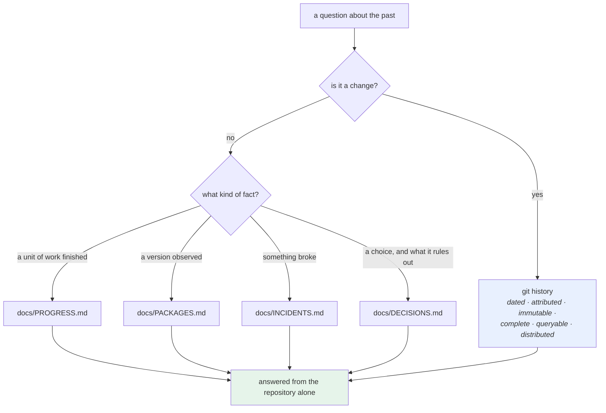

# 5.1 — The repository is the incident record

## One-line answer

Day 1 claimed the repository is the memory rather than the chat; this is the day that claim becomes
mechanical — **the git history is a dated, immutable, queryable record**, and the four ledgers are the parts of
it a machine cannot infer.

---

## The story

🎬 **The scene.** A lifeboat station with a wall of logbooks going back to 1904.

Every launch has an entry: the time, the weather, who was aboard, what was found, what was done. The
handwriting changes every few years and the format does not.

😬 **The naive fix.** A modernising committee proposes replacing it with the crew's group chat, where all of
this is already discussed in far more detail and in real time.

💥 **Why it fails.** In 2019 an inquiry asks about a launch in 1987. The logbook has it in ninety seconds. The
chat — had it existed — would be searchable in principle, unsearchable in practice, missing everyone who
left, and unable to prove that an entry had not been edited.

**The chat has more information and no memory.** Its content is a stream: the useful entry from 1987 is
somewhere between four thousand messages about the weather and a discussion about a kettle.

💡 **The insight.** **A record is not a place where things were said — it is a place where things were
deliberately written down, in a fixed shape, at the moment they happened.** The difference is not volume; it
is that somebody chose the shape, and the shape is what makes retrieval possible years later.

---

## The idea in plain language

Day 1's second section made the argument
([Day 1, 2.1](../../../day-001-what-operations-actually-is/parts/02-the-repo-remembers/2.1-why-the-chat-is-not-the-memory.md)):
the repository is the memory. **Section 1 of today gave the mechanism.** A git history is:

| Property | From |
| --- | --- |
| **dated** | every commit has an author and a committer date ([1.1](../01-the-object-model/1.1-a-commit-is-a-snapshot-with-a-parent.md)) |
| **attributed** | author and committer |
| **immutable** | the hash covers the content; altering anything changes every commit after it |
| **complete** | every commit is a full snapshot, not a change |
| **queryable** | [3.1](../03-reading-history/3.1-log-as-a-query-language.md) |
| **distributed** | every clone is a copy, so the record survives the machine |

**No other artifact in this project has all six.** A wiki is editable and undated; a chat is a stream; a
ticket system is queryable and outlives nothing.

### What git records and what it cannot

The history records **what changed, when, by whom** — and it cannot record:

- **why**, beyond what somebody chose to type
  ([2.1](../02-the-message/2.1-what-a-commit-message-is-for.md));
- **what happened that was not a change** — an outage, a measurement, a decision not to do something;
- **what was true about the world** — a version observed, a limit measured, an incident's first symptom.

That gap is exactly why this project has four ledgers
([Day 1, 2.2](../../../day-001-what-operations-actually-is/parts/02-the-repo-remembers/2.2-the-four-ledgers.md)):

| Ledger | Records | Which git cannot infer |
| --- | --- | --- |
| `docs/PROGRESS.md` | which day was completed, when, with which IDs | that a *unit of work* finished |
| `docs/PACKAGES.md` | a version observed on a date, and why | that a number came from the world rather than a guess |
| `docs/INCIDENTS.md` | a symptom, a cause, a fix | that something broke — no commit records an outage |
| `docs/DECISIONS.md` | a choice, its alternatives, its expiry condition | why the code is *not* something else |

**They are files in git**, so they inherit all six properties — and they carry the facts a diff cannot.

### The property that makes it a record rather than a log

**Append-only.** `docs/PROGRESS.md` says so at the top; `docs/INCIDENTS.md` rows are never edited; the release
ledger from Day 10 is explicitly append-only
([Day 10, 2.2](../../../day-010-environments-and-promotion/parts/02-promotion/2.2-build-release-run.md)).

That is the same rule as [4.2](../04-undo/4.2-revert-versus-reset.md)'s: **corrections are new entries, not
edits.** A ledger you can edit is one whose past cannot be trusted, and the whole value is in the past.

### The 2am test

The practical question this part exists to answer: **can you reconstruct an incident from the repository
alone?**

- *When did this change?* — `git log -- <path>`
- *What else changed at the same moment?* — `git show <commit> --stat`
- *Why?* — the commit message, and `docs/DECISIONS.md`
- *Has this broken before?* — `docs/INCIDENTS.md`
- *What version were we running?* — `docs/PACKAGES.md`, and Day 10's release records
- *When did we last deploy?* — `docs/PROGRESS.md`, and Day 10's ledger

**Six questions, six commands, no chat, no colleague, no memory.**

---

## Why Kriya needs it

**[5.3](5.3-the-2am-drill.md)** is the drill: answer a question about the past using only the repository.

**Day 82's postmortem** is this at full size — a timeline built from the history and the ledgers.

**Day 79's runbook** is the fifth document, one per alert, and it is written *because* the first four cannot
tell you what to do.

**Day 217's auditability** asks whether the record can be trusted, which is
[1.1](../01-the-object-model/1.1-a-commit-is-a-snapshot-with-a-parent.md)'s hash chain plus
[4.3](../04-undo/4.3-the-force-push-and-the-reflog.md)'s protected branch.

**Day 231's handover** is the test Day 1 set: a stranger picks this up from the repository alone
([Day 1, 3.1](../../../day-001-what-operations-actually-is/parts/03-the-handover-test/3.1-the-handover-test.md)).

**Day 232's day-2 operations** is you, six months later, as the stranger.

---

## The mechanism

Interrogate this repository as if you had never seen it. **Every command is read-only.**

**Question one — what is this and when did it start?**

```bash
cd "$(git rev-parse --show-toplevel)"
echo "first commit : $(git log --reverse --format='%ad  %s' --date=short | head -1)"
echo "last commit  : $(git log -1 --format='%ad  %s' --date=short)"
echo "commits      : $(git rev-list --count HEAD)"
echo "contributors : $(git shortlog -sn --all | wc -l)"
```

**Line by line:**

- Four facts about the shape of the project, from four one-liners. **Run these first on any repository you
  inherit** — they tell you whether you are looking at a week of work or a decade.
- `--reverse | head -1` for the oldest ([3.1](../03-reading-history/3.1-log-as-a-query-language.md)).

```text
first commit : 2026-08-24  init
last commit  : 2026-08-25  day 8
commits      : 5
contributors : 1
```

**Question two — what does the project say about itself?**

```bash
cd "$(git rev-parse --show-toplevel)"
for f in docs/PROGRESS.md docs/PACKAGES.md docs/INCIDENTS.md docs/DECISIONS.md; do
  if [ -f "$f" ]; then
    printf '%-22s rows=%-4s last-changed=%s\n' "$(basename "$f")" \
      "$(grep -c '^| [0-9]' "$f" 2>/dev/null || echo 0)" \
      "$(git log -1 --format='%ad' --date=short -- "$f")"
  else
    printf '%-22s MISSING\n' "$(basename "$f")"
  fi
done
```

**Line by line:**

- `grep -c '^| [0-9]'` counts table rows beginning with a number — **the ledgers' data rows**, excluding
  headers and prose. Crude, and it works because all four use the same table shape.
- `git log -1 --format='%ad' -- "$f"` — **when the file last changed**, which is the useful number: a ledger
  nobody has updated in six months is a ledger that is not being kept.
- The `MISSING` branch matters: **a ledger that does not exist is a finding**, and printing `0` for it would
  hide that.

```text
PROGRESS.md            rows=1    last-changed=2026-08-24
PACKAGES.md            rows=0    last-changed=2026-08-24
INCIDENTS.md           rows=0    last-changed=2026-08-24
DECISIONS.md           rows=0    last-changed=2026-08-24
```

**Read that honestly.** One progress row for a project with eight days written, and **zero rows in the other
three** — which is accurate: the days are written and not yet worked through, so no package has been observed,
no incident has happened and no decision has been recorded beyond the four ADRs from Day 0. **The report is
telling the truth about the state of the project**, which is what a report is for.

**Question three — what changed recently, and what does it touch?**

```bash
cd "$(git rev-parse --show-toplevel)"
git log --since='2 days ago' --format='%h %ad %s' --date=short --name-only \
  | awk '/^[0-9a-f]{7} /{c=$0; n=0; next} NF{n++} END{}
         /^[0-9a-f]{7} /{next} {}' >/dev/null 2>&1
git log --since='2 days ago' --format='%h %ad %s' --date=short --shortstat \
  | grep -E '^[0-9a-f]{7} |files? changed'
```

**Line by line:**

- The first pipeline is deliberately left as a no-op — **it is here to be deleted.** `TODO(me)`: it was an
  attempt at grouping file names under each commit with `awk` and it does nothing useful; write a version that
  works, or delete it and say why the `--shortstat` version below is sufficient. **A command in a document
  that does nothing is a bug in the document**, and finding it is the exercise.
- `--shortstat` gives one summary line per commit, and the `grep -E` keeps the commit line and its stat line
  and drops the blanks ([3.1](../03-reading-history/3.1-log-as-a-query-language.md)).

```text
14a1dcd 2026-08-25 day 8
 21 files changed, 5842 insertions(+)
eec9e0a 2026-08-25 day 7
 18 files changed, 4901 insertions(+)
2c36b16 2026-08-24 day 000: record the day's commit hash in PROGRESS.md and the hub
 2 files changed, 3 insertions(+), 1 deletion(-)
```

**Question four — the one that requires the ledgers.** Build the reconstruction script:

```bash
# lab/history_report.sh - answer the six 2am questions from the repository alone.
set -u
ROOT="$(git rev-parse --show-toplevel)"
cd "$ROOT"
SINCE="${1:-7 days ago}"

echo "=== changes since $SINCE ==="
git log --since="$SINCE" --format='  %ad  %h  %an  %s' --date=short || true

echo
echo "=== which files changed most in that window ==="
git log --since="$SINCE" --format='' --name-only | grep -v '^$' | sort | uniq -c | sort -rn | head -5

echo
echo "=== incidents recorded in that window ==="
if [ -f docs/INCIDENTS.md ]; then
  awk -F'|' 'NR>2 && NF>3 { gsub(/ /,"",$3); print "  " $3 "  " $5 }' docs/INCIDENTS.md | tail -5
  [ "$(grep -c '^| [0-9]' docs/INCIDENTS.md)" -gt 0 ] || echo "  (no incident rows yet)"
else
  echo "  docs/INCIDENTS.md MISSING"
fi

echo
echo "=== decisions that constrain what we may do ==="
if [ -f docs/DECISIONS.md ]; then
  grep -E '^\| \[ADR' docs/DECISIONS.md | cut -d'|' -f2,4,5 | sed 's/^/  /' | tail -5
else
  echo "  docs/DECISIONS.md MISSING"
fi

echo
echo "=== versions we have actually observed ==="
if [ -f docs/PACKAGES.md ]; then
  grep -E '^\| [a-z]' docs/PACKAGES.md | cut -d'|' -f2,3,4 | sed 's/^/  /' | head -6
else
  echo "  docs/PACKAGES.md MISSING"
fi
```

**Line by line:**

- `SINCE="${1:-7 days ago}"` — a **default** here rather than a required argument, because unlike a gate this
  is a report: a wrong window produces a wrong report, not a wrong action. **Knowing when a default is
  acceptable is the point** — every check in Day 9 and Day 10 required its argument because a default would
  have made them pass vacuously.
- `|| true` after the first `git log`, so an empty window is not a failure.
- `awk -F'|'` splits the Markdown table on pipes; `NR>2` skips the header and separator rows; `NF>3` skips
  prose lines that contain no pipes. **Parsing Markdown tables with `awk` is exactly as fragile as it looks**,
  and it is honest for a report that a human reads.
- The `[ "$(grep -c …)" -gt 0 ] || echo "(no incident rows yet)"` line is **the check that the check ran** —
  an empty table produces "(none)" rather than silence, so an empty section is distinguishable from a broken
  parser. **This is the seventh time in three days that this pattern has been necessary.**
- Every section handles the **missing file** case separately from the **empty file** case, because they mean
  different things: missing means the practice does not exist; empty means it exists and has recorded nothing.

```bash
cd "$(git rev-parse --show-toplevel)"
bash days/day-011-version-control-for-operators/lab/history_report.sh '3 days ago'
```

**Line by line:**

- A three-day window, so the report covers the whole of this repository's life so far.

```text
=== changes since 3 days ago ===
  2026-08-25  14a1dcd  aignishant  day 8
  2026-08-25  eec9e0a  aignishant  day 7
  2026-08-24  2c36b16  aignishant  day 000: record the day's commit hash in PROGRESS.md and the hub
  2026-08-24  5a8edee  aignishant  day 000: toolchain, skeleton and the ./o driver — closes no IDs
  2026-08-24  8f64745  aignishant  init

=== which files changed most in that window ===
      2 docs/PROGRESS.md
      1 uv.lock
      1 pyproject.toml

=== incidents recorded in that window ===
  (no incident rows yet)

=== decisions that constrain what we may do ===
   [ADR-0001]  accepted  Kriya exists as a distinct curriculum: ops for AI systems...
   [ADR-0004]  accepted  Eighty-four days of platform, observability and SRE come before...

=== versions we have actually observed ===
   git  2.54.0.windows.1  2026-08-24
   uv  0.12.3  2026-08-24
   python  3.12.10  2026-08-24
```

**Six questions, one command.** And note what the report exposes: the commit messages for Days 7 and 8 say
`day 7` and `day 8`, which tell a reconstructing operator nothing — **the report's usefulness is bounded by the
messages' quality**, which is [2.1](../02-the-message/2.1-what-a-commit-message-is-for.md)'s argument arriving
as a measurable consequence.



---

## When it breaks

**The ledger that stopped being kept.** The most common decay:

```text
$ git log -1 --format='%ad' --date=short -- docs/INCIDENTS.md
2025-11-04
$ # ...and there have been four incidents since
```

**What it says:** the file has not changed in months.
**What it actually means:** the practice lapsed. **And the file is worse than absent**, because its existence
implies completeness: somebody reading it concludes there were no incidents after November.
**The smallest fix:** backfill what people remember, dated as "recorded late", and put the ledger row on the
incident checklist so it is a step rather than an intention.
**Why the "last changed" query is worth running:** it is the only way to distinguish *"nothing happened"* from
*"nobody wrote it down"*, and the two look identical from inside the file.

**The decision that nobody could find.** A record with no address:

```text
$ grep -ri 'why do we pin link-mode' docs/
$ # ...nothing
$ git log --all -S 'link-mode' --oneline
5a8edee day 000: toolchain, skeleton and the ./o driver — closes no IDs
```

**What it says:** no document explains it; one commit introduced it.
**What it actually means:** the reasoning is in a **code comment** rather than in `docs/DECISIONS.md` — which
is where it happens to be in this repository, and it is a genuinely defensible choice for a two-line setting.
**The general failure is when the reasoning is nowhere**, and the tell is that the pickaxe finds the commit and
the commit message says `day 000`.
**The smallest fix:** an ADR when the choice is expensive to reverse and non-obvious to a stranger — which is
`docs/DECISIONS.md`'s own stated bar
([Day 1, 2.4](../../../day-001-what-operations-actually-is/parts/02-the-repo-remembers/2.4-the-adr-and-its-expiry-condition.md)).
**Why not an ADR for everything:** a decision log with sixty entries has the chat's problem — volume without
retrieval.

**The history that was rewritten.** The record that stopped being one:

```text
$ git log --format='%h %ad %s' --date=short -- pulse/config.py
$ # ...three commits, all dated today, for a file that is months old
```

**What it says:** a file with no history before today.
**What it actually means:** somebody rebased or squashed a long-lived branch, or force-pushed a rewritten
history ([4.3](../04-undo/4.3-the-force-push-and-the-reflog.md)). **The dates are the committer dates of the
rewrite**, and the original authorship and sequence are gone from the branch.
**The smallest fix:** none. This is the cost of a rewrite and it is why protected branches exist.
**Why it matters here specifically:** the six properties at the top of this part are what make the repository a
record, and *immutable* is one of them. A rewritable history is a wiki with better tooling.

**The report that read a broken table.** The parser, failing quietly:

```text
=== incidents recorded in that window ===
    
    
    
```

**What it says:** three blank rows.
**What it actually means:** somebody added a column to `docs/INCIDENTS.md`, so `$3` and `$5` in the `awk` are
now different fields. **The report did not error** — it printed whitespace, which reads as "nothing to
report".
**The smallest fix:** parse by header name rather than by position — the technique
[Day 10, 3.2](../../../day-010-environments-and-promotion/parts/03-what-production-promises/3.2-data-is-the-thing-that-cannot-be-promoted.md)
used and [Day 10, 3.1](../../../day-010-environments-and-promotion/parts/03-what-production-promises/3.1-what-the-word-production-promises.md)
deliberately did not.
**The recurring lesson:** **a positional parser over a human-edited file is a time bomb**, and the failure mode
is always silence rather than an error.

---

## In production

**What a professional writes instead of the teaching version.** The ledgers are not Markdown tables parsed by
`awk` — they are the incident tracker, the change management system and the artifact registry, and the report
is a query against them. **What survives from this part is the discipline rather than the format**: a fixed
place for each kind of fact, append-only, dated, and referenced from commit messages by trailer
([2.2](../02-the-message/2.2-the-anatomy-of-a-message.md)) so the history and the ledgers point at each other.
That cross-referencing is the thing that makes reconstruction fast, and it is almost always missing.

**What degrades at scale.** Retrieval, exactly as in the story. A history of five commits is readable; a
history of two hundred thousand is only usable through queries
([3.1](../03-reading-history/3.1-log-as-a-query-language.md)), and a decision log of sixty entries is
unsearchable in practice. The counter-measure is **structure at write time**: consistent commit shapes,
trailers that name the incident or ADR, and ledgers with stable columns. Everything that makes retrieval
possible has to be paid for when the entry is written, by somebody who does not yet need it.

**The failure that only shows with real traffic.** Not applicable — the repository is not on a serving path.
**The production-shaped version is the postmortem** (Day 82): under time pressure, with people waiting, the
reconstruction either takes twenty minutes or takes a day, and which one it is was decided months earlier by
whether anybody wrote the entries. **The cost is always paid by a different person at a worse moment**, which
is why it needs to be a checklist step rather than a good intention.

**The review comment a senior engineer leaves.** *"This PR changes the retry policy and there is no ADR. The
next person will see a retry ladder that looks arbitrary and either change it or work around it. Add the ADR
with the measurement and the expiry condition, and put a `Refs:` trailer on the commit so the two point at each
other."*

**The signal you would alert on.** Nothing runtime — but two cheap **gates** are worth having and are rarely
built: a check that `docs/INCIDENTS.md` gained a row when an incident label was applied, and a check that a
commit touching a directory with an ADR references one. Both are noisy if done badly. The one that is
unambiguously worth it is **a staleness report**: last-changed dates for each ledger, on a dashboard, monthly.
It is the only signal that distinguishes *"nothing happened"* from *"nobody wrote it down"*, and it costs one
`git log` per file.

**Blast radius.** Every command in this part is read-only against this repository — `git log`, `git shortlog`,
`grep`, `awk` — plus one script written into this day's `lab/`, which `.gitignore` excludes. Nothing writes to
the object database, moves a pointer, or starts a process. Worst case: the report's fragile table parsing
prints misleading output, which is exactly the failure documented above and is why the "(no incident rows
yet)" guard is there. Who can trigger it: you. **The genuine risk in this part is the opposite of technical:
a report that looks thorough and is silently wrong is more dangerous than no report**, which is the same
vacuous-check shape as every other gate in this curriculum.

**Cost.** `0` model calls, `0` tokens, `0` CI minutes, `0` new packages, `0` network, `0` servers. Disk: one
small script under `lab/`. RAM: negligible.

**The interview question.** *"Where does your team's operational memory live?"* The answer that shows the
split: *"In the repository, and deliberately not in chat. The git history gives me six properties nothing else
has together — dated, attributed, immutable, complete rather than incremental, queryable and distributed — so
'when did this change and what else changed with it' is a command rather than an investigation. What git
cannot record is anything that was not a change: an outage, a version somebody observed, a decision not to do
something. Those go in four append-only ledgers in the same repository, so they inherit the same properties.
The test I apply is whether I can reconstruct an incident from the repository alone: when it changed, what
else changed with it, why, whether it has broken before, what version we were running. If any of those needs a
person, that is the gap to close — and the one that decays first is the incident ledger, because the only way
to tell 'nothing happened' from 'nobody wrote it down' is to look at when the file last changed."*

---

## Check yourself

```bash
cd "$(git rev-parse --show-toplevel)"
for f in docs/PROGRESS.md docs/PACKAGES.md docs/INCIDENTS.md docs/DECISIONS.md; do
  printf '%-22s rows=%-4s last-changed=%s\n' "$(basename "$f")" \
    "$(grep -c '^| [0-9]' "$f" 2>/dev/null || echo 0)" \
    "$(git log -1 --format='%ad' --date=short -- "$f")"
done
git log --format='%h %s' | head -3
```

Four ledgers with their row counts and last-changed dates, and three commit subjects — **two of which tell a
reconstructing operator nothing.**

**Say out loud, without scrolling up:** *Name the six properties that make a git history a record, name two
kinds of fact it cannot hold, and give the query that distinguishes "nothing happened" from "nobody wrote it
down".*
