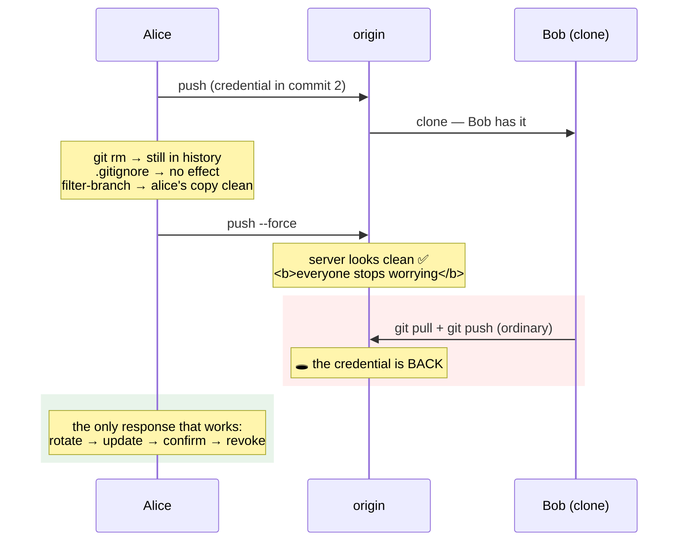

# 5.2 — The secret that reached history

## One-line answer

Today's deliberate failure is the sequel to Day 9's: a credential enters a commit, and **deleting the file,
adding it to `.gitignore` and rewriting the history all fail to remove it** — because a commit is immutable, a
clone is a copy, and the only response that works is rotation.

---

## The story

🎬 **The scene.** A local newspaper that prints, on a Tuesday, a photograph in which a house number and a set
of keys on a table are both clearly legible.

😬 **The naive fix.** Somebody spots it at eleven. The website version is edited within the hour, and the
photograph is replaced in the archive.

💥 **Why it fails.** Eleven thousand copies were delivered at six. They are on kitchen tables, in cafés, in
recycling bins, in a pile at the newsagent, and in the hands of the one person for whom this matters.

**Every action taken was correct and none of it was a recall.** By lunchtime the paper's own records show a
clean photograph, which means the editor believes the problem is handled — **and the belief is the most
dangerous part**, because the family is not told to change the locks.

💡 **The insight.** **Editing your copy of a distributed thing does not edit the distributed thing — it only
removes your ability to see the problem.** The correct response was never about the photograph. It was to
change the locks, immediately, and to treat the print run as gone.

---

## The idea in plain language

Day 9 listed seven leak paths and put version control first, because it is the one whose exposure is
permanent
([Day 9, 4.2](../../../day-009-configuration-and-secrets/parts/04-secrets/4.2-the-seven-places-a-secret-leaks.md)).
**Today's object model says why.**

A commit stores a complete tree, and its name is the hash of that content plus its parent's hash
([1.1](../01-the-object-model/1.1-a-commit-is-a-snapshot-with-a-parent.md)). So:

| What people try | What actually happens |
| --- | --- |
| delete the file and commit | a **new** commit whose tree lacks the file; every earlier commit still contains it |
| add it to `.gitignore` | nothing — `.gitignore` only affects **untracked** files ([1.2](../01-the-object-model/1.2-the-three-trees.md)) |
| `git rm --cached` | removes it from the index going forward; history unchanged |
| `git commit --amend` | a new commit; the old one is unreferenced and still in the object database |
| rewrite the history and force-push | new hashes for every commit after it — **and every clone still has the old ones** ([4.3](../04-undo/4.3-the-force-push-and-the-reflog.md)) |

**Every row is a real thing people do and none of them removes the credential from the world.**

### Why the rewrite is the most dangerous of the five

It is the only one that *looks* like it worked. After a rewrite, `git log --all -S '<the key>'` on your machine
returns nothing — so the check you would use to verify says clean.

Meanwhile:

- every existing clone has the original commits;
- the server's object database has them until its garbage collection runs, and you do not control that;
- a fork, a mirror or a CI cache has them;
- and **direction two** from [4.3](../04-undo/4.3-the-force-push-and-the-reflog.md) can put them straight
  back, through an ordinary `git pull` and `git push` by somebody who was not told.

**So the rewrite converts a known exposure into an unknown one**, and stops everybody treating the credential
as compromised.

### The response, in order

```text
1. rotate      issue a new credential; both valid          (Day 9, 4.4)
2. update      every holder, one at a time, verifying each
3. confirm     no traffic on the old one
4. revoke      the old credential
5. record      docs/INCIDENTS.md — first symptom before cause
6. prevent     the gate that would have refused the commit  (Day 17)
7. consider    the history rewrite, last, and only with coordination
```

**Steps 1–4 come before everything else**, and step 7 is optional. That ordering is the entire lesson, and it
is the reverse of everybody's instinct — because the code is the part you understand and the credential is the
part that is live.

### When a rewrite is worth doing anyway

Rarely, and for one reason: **the repository is about to become public**, or already is, and the exposure
window continues as long as the object is fetchable. Even then it is *housekeeping after rotation*, it
requires coordinating every clone, and it invalidates every hash anybody has recorded — including Day 10's
release records
([Day 10, 2.1](../../../day-010-environments-and-promotion/parts/02-promotion/2.1-build-once-promote-the-artifact.md)).

**Project Kriya goes public in Phase 23** (plan §13). That is not a reason to rewrite; it is a reason for
Day 17's gate to exist now.

---

## Why Kriya needs it

**Day 9 flagged this without being able to explain it**
([Day 9, 1.5](../../../day-009-configuration-and-secrets/parts/01-configuration/1.5-dotenv-is-a-developer-convenience.md)),
because the explanation is the object model, which is section 1 of today.

**Day 17** builds the gate: a scan that refuses a push containing a credential.

**Day 23's `.dockerignore`** is the same failure one layer over — `COPY . .` puts `.git` in an image, so the
whole history ships.

**Day 57's secret store** and **Day 220's workload identity** remove the class by removing the long-lived
credential.

**Phase 23 makes this repository public**, which turns every past commit into a published document.

**Day 217's auditability** is the other side of the same property: history that cannot be quietly edited is
the point, and it is also why the leak cannot be quietly removed.

---

## The mechanism

Commit a marker, then try all five removals and watch each one fail. **A bare remote and two clones under a
temporary directory** — the exposure is about *copies*, so one repository cannot demonstrate it.

**Use a marker, never a real credential.** Same rule as Day 9
([Day 9, 4.2](../../../day-009-configuration-and-secrets/parts/04-secrets/4.2-the-seven-places-a-secret-leaks.md)):

```bash
BASE=$(mktemp -d)
MARK='LEAKDEMO-history-not-a-real-credential-0011'
git init -q --bare "$BASE/origin.git"
git clone -q "$BASE/origin.git" "$BASE/alice" && cd "$BASE/alice"
git config user.email alice@example.invalid && git config user.name Alice

printf 'x = 1\n' > app.py && git add app.py && git commit -q -m "feat: add the app"
printf 'API_KEY = "%s"\n' "$MARK" > config.py
git add config.py && git commit -q -m "feat: wire up the provider"
printf 'x = 2\n' > app.py && git commit -q -am "feat: extend the app"
git push -q -u origin main

git clone -q "$BASE/origin.git" "$BASE/bob"
echo "alice: $(git log --oneline | wc -l) commits, pushed"
echo "bob:   $(cd "$BASE/bob" && git log --oneline | wc -l) commits, cloned"
```

**Line by line:**

- The value contains `not-a-real-credential`, so anyone who finds it later knows instantly it is harmless.
- **Three commits**, with the credential in the middle one — so removing it is not simply "undo the last
  commit", which is the case that makes people think it is easy.
- Bob's clone is taken **after** the push. That clone is the eleven thousand newspapers.

```text
alice: 3 commits, pushed
bob:   3 commits, cloned
```

**Attempt one — delete the file:**

```bash
cd "$BASE/alice"
git rm -q config.py && git commit -q -m "fix: remove the credential file"
ls config.py 2>&1 | tail -1
echo "--- is it still in the history? ---"
git log --all -S "$MARK" --oneline
echo "--- can we still read it? ---"
git show "$(git log --all -S "$MARK" --format=%H | tail -1):config.py"
```

**Line by line:**

- `git rm` removes the file from the working tree **and** the index, then a commit records the removal
  ([1.2](../01-the-object-model/1.2-the-three-trees.md)).
- `git log --all -S "$MARK"` — the pickaxe from
  [3.1](../03-reading-history/3.1-log-as-a-query-language.md), which finds commits where the count changed:
  the one that added it and the one that removed it.
- `git show <commit>:<path>` reads the file **out of a historical commit**
  ([1.1](../01-the-object-model/1.1-a-commit-is-a-snapshot-with-a-parent.md)) — the file does not exist on disk
  and its content is one command away.

```text
ls: cannot access 'config.py': No such file or directory
--- is it still in the history? ---
9c1e4a7 fix: remove the credential file
4b8d2f0 feat: wire up the provider
--- can we still read it? ---
API_KEY = "LEAKDEMO-history-not-a-real-credential-0011"
```

**The file is gone and the value is not.** This is the attempt almost everybody makes and stops at.

**Attempt two — `.gitignore`:**

```bash
cd "$BASE/alice"
echo 'config.py' >> .gitignore
git add .gitignore && git commit -q -m "chore: ignore config.py"
git log --all -S "$MARK" --oneline | wc -l
echo "(still findable — .gitignore only affects UNTRACKED files)"
```

**Line by line:**

- `.gitignore` governs whether git *starts* tracking a file. **It has no effect on anything already in a
  commit**, and no effect on a tracked file either — the rule Day 9 stated and could not yet explain.

```text
2
(still findable — .gitignore only affects UNTRACKED files)
```

**Attempt three — rewrite the history:**

```bash
cd "$BASE/alice"
git filter-branch --force --index-filter \
  'git rm --cached --ignore-unmatch -q config.py' \
  --prune-empty -- --all 2>&1 | tail -2
echo "--- alice's history now ---"
git log --all -S "$MARK" --oneline || echo "(nothing — alice's copy is clean)"
```

**Line by line:**

- `git filter-branch --index-filter '<command>'` rewrites every commit by running the command against each
  commit's **index** — cheaper than checking out a working tree per commit. It is the built-in tool; the
  faster and now-recommended one is `git filter-repo`, which is a separate install and would add a dependency
  this day does not need.
- `git rm --cached --ignore-unmatch` removes the path from the index if present; `--ignore-unmatch` stops it
  failing on commits that never had the file.
- `--prune-empty` drops commits that become empty as a result.
- `-- --all` applies it to every ref. **Everything after `--` is passed to `rev-list`.**
- `2>&1 | tail -2` because `filter-branch` prints a large warning recommending `filter-repo` — **which is
  correct advice and worth reading once**; it is trimmed here so the demonstration's output stays legible.
- **Every commit now has a different hash**, because the tree changed and the hash covers the tree
  ([1.1](../01-the-object-model/1.1-a-commit-is-a-snapshot-with-a-parent.md)).

```text
Ref 'refs/heads/main' was rewritten
--- alice's history now ---
(nothing — alice's copy is clean)
```

**Alice's check says clean.** Now look at everybody else:

```bash
echo "--- the SERVER still has it ---"
git --git-dir="$BASE/origin.git" log --all -S "$MARK" --oneline
echo "--- BOB still has it ---"
( cd "$BASE/bob" && git log --all -S "$MARK" --oneline )
echo "--- and alice's own object database still has it ---"
cd "$BASE/alice"
git reflog --all 2>/dev/null | head -2
git fsck --lost-found 2>/dev/null | grep -c 'dangling commit' || echo 0
```

**Line by line:**

- The server has not been pushed to yet, so it holds the **original** commits.
- Bob's clone is untouched by anything Alice did.
- **Alice's own repository still has the old objects too** — unreferenced, in the reflog and as dangling
  objects ([1.4](../01-the-object-model/1.4-nothing-is-lost-the-object-database.md)) — so even her "clean"
  result is a statement about *reachability*, not about the database.

```text
--- the SERVER still has it ---
4b8d2f0 feat: wire up the provider
--- BOB still has it ---
4b8d2f0 feat: wire up the provider
--- and alice's own object database still has it ---
9c1e4a7 refs/heads/main@{0}: filter-branch: rewrite
dangling commit 4b8d2f0f1a2d6058c7e3b0a9f2d1c4e7b6a5308f
```

**Three copies, one of which is Alice's own.** The `git log --all -S` check that returned nothing was
answering a narrower question than she asked.

**Attempt four — force-push, and watch it come back:**

```bash
cd "$BASE/alice"
git push --force -q origin main
echo "--- server after the force-push ---"
git --git-dir="$BASE/origin.git" log --all -S "$MARK" --oneline || echo "(clean, for now)"

echo "--- Bob does an ordinary pull and push ---"
( cd "$BASE/bob" && git pull --no-rebase -q --allow-unrelated-histories 2>/dev/null; \
  printf 'x = 3\n' > app.py; git commit -q -am "feat: extend further"; git push -q 2>/dev/null )

echo "--- server now ---"
git --git-dir="$BASE/origin.git" log --all -S "$MARK" --oneline || echo "(clean)"
```

**Line by line:**

- The force-push replaces the server's `main` with Alice's rewritten history — **and the check immediately
  after says clean**, which is the moment everybody declares victory.
- Bob's `pull` merges his (original) history with the rewritten one. `--allow-unrelated-histories` is needed
  because the rewrite gave every commit a new hash, so from git's point of view these are two different
  histories that share nothing.
- His push puts his side back on the server — **including the commit containing the credential.**

```text
--- server after the force-push ---
(clean, for now)
--- Bob does an ordinary pull and push ---
--- server now ---
4b8d2f0 feat: wire up the provider
```

**It is back.** Nobody did anything wrong; Bob ran two ordinary commands. **Between the force-push and this
moment, everybody believed the credential was removed** — which is the newspaper's editor, at lunchtime.

### What actually works

```bash
cd "$BASE/alice"
cat > INCIDENT.md <<'EOF'
# Credential exposure — response

First symptom: `git log --all -S 'LEAKDEMO'` returned a commit on main.

1. [ ] rotate    — issue a new credential; both valid          (Day 9, 4.4)
2. [ ] update    — every holder, one at a time, verifying each
3. [ ] confirm   — provider console shows no traffic on the old one
4. [ ] revoke    — the old credential
5. [ ] record    — docs/INCIDENTS.md, first symptom before cause
6. [ ] prevent   — a push-time secret scan                     (Day 17)
7. [ ] consider  — a coordinated history rewrite. LAST, and optional.

Note: steps 1-4 are the response. Everything else is housekeeping, and the
history rewrite is the only step that can make people *believe* it is handled
while it is not.
EOF
cat INCIDENT.md
cd /tmp && rm -rf "$BASE"
```

**Line by line:**

- A checklist rather than prose, because **this gets used during an incident** and prose does not survive
  that.
- The **first symptom** is written at the top, before any cause — the rule from Day 1
  ([Day 1, 2.3](../../../day-001-what-operations-actually-is/parts/02-the-repo-remembers/2.3-the-first-symptom-column.md)).
- Step 7 is present and marked optional, because **omitting it entirely invites somebody to do it first**.
- The closing note names the specific danger: the rewrite's effect on *belief*, not on the credential.

```text
# Credential exposure — response
First symptom: `git log --all -S 'LEAKDEMO'` returned a commit on main.
1. [ ] rotate    — issue a new credential; both valid          (Day 9, 4.4)
...
```



---

## When it breaks

**The scanner that found it after the push.** The detection that is too late:

```text
remote: error: GH013: Repository rule violations found for refs/heads/main.
remote: - GITHUB PUSH PROTECTION
remote:   Push cannot contain secrets
remote:     - commit: 7f21ba4, path: pulse/client.py:14
```

**What it says:** the push was refused.
**What it actually means:** **the commit exists locally**, and if the same value is on any other machine or was
ever pushed to any other remote, the exposure is already real. Push protection is a last line, not a defence.
**The smallest fix:** rotate. Then, separately and less urgently, decide what to do about the local commit —
which, being unpushed, is the one case where an amend or a `reset` is genuinely sufficient
([4.1](../04-undo/4.1-the-four-undos.md)).
**Why the order still matters here:** even in the lucky case, doing the history surgery first means minutes
during which the credential is live and you are not thinking about it.

**The rewrite that broke every recorded hash.** The collateral damage:

```text
$ cat days/day-010-environments-and-promotion/lab/releases/r003.json
{ "release_id": "r003", "build_id": "build-14a1dcd2f0b4", ... }
$ git cat-file -t 14a1dcd2f0b4
fatal: Not a valid object name
```

**What it says:** a recorded build identity no longer resolves.
**What it actually means:** the rewrite gave every commit a new hash
([1.1](../01-the-object-model/1.1-a-commit-is-a-snapshot-with-a-parent.md)), so **every artifact identity,
release record, deployment log, issue reference and code review link pointing at a commit is now a dangling
pointer** ([Day 10, 2.1](../../../day-010-environments-and-promotion/parts/02-promotion/2.1-build-once-promote-the-artifact.md)).
**The smallest fix:** none that is cheap. This is the cost of a rewrite and it is why step 7 is last.
**Why it is worse in a mature system:** the more you have built on commit hashes as identities — which is
correct and which Day 10 encourages — the more expensive a rewrite becomes.

**The `.gitignore` that was added too late.** Day 9's flagged case, explained:

```text
$ echo '.env' >> .gitignore
$ git status --short
 M .env
$ git log --all -- .env --oneline
c41a9e7 wip: get the local run working
```

**What it says:** `.env` still shows as modified and appears in the history.
**What it actually means:** it is **tracked** — in the index — and `.gitignore` only governs untracked files
([1.2](../01-the-object-model/1.2-the-three-trees.md)). The rule does nothing for a file git is already
following, and nothing at all for commits.
**The smallest fix:** `git rm --cached .env` stops future tracking; the history is unchanged and the
credential is compromised.
**Why this is the most common entry point:** the sequence *"oh no — add it to `.gitignore`"* feels like the
fix, produces no error, and leaves the exposure exactly as it was.

**The credential that was never in a file.** The path scanners miss:

```text
$ git log --all --grep='sk-or-v1' --oneline
7f21ba4 use the new provider key sk-or-v1-3f9a2c8e1b7d4a6f0c5e2b8d9a1f3c7e for staging
```

**What it says:** a credential in a commit **message**.
**What it actually means:** the message is part of the commit object, so it is covered by the hash and travels
with every clone — **and a scanner that inspects file contents finds nothing.** Removing it requires rewriting
the commit, with all of the above.
**The smallest fix:** rotate, and make the scanner check messages as well as diffs (Day 17).
**Why it happens:** a message feels ephemeral while you type it, like a chat line
([2.1](../02-the-message/2.1-what-a-commit-message-is-for.md)), and it is the opposite of ephemeral.

---

## In production

**What a professional writes instead of the teaching version.** They have a written incident procedure whose
first four steps are rotation, and they do not debate the history until those are done. The prevention is a
**push-time scan on the server** — refusing rather than reporting — plus a local pre-commit hook so the common
case is caught before it is even a commit. And when a rewrite genuinely is warranted, it is a coordinated
operation: every clone re-cloned, every mirror updated, every recorded hash reconciled, announced in advance.
**It is a project, not a command.**

**What degrades at scale.** The number of copies, which is the whole problem. One clone is recoverable; a
repository with forks, mirrors, CI caches, build artifacts containing `.git`, and developer machines that have
been offline for a week is not something you can clean. **At that point "remove it from history" stops being a
meaningful goal** and the entire response is rotation plus prevention — which is why mature organisations
invest in the gate and treat the rewrite as out of scope.

**The failure that only shows with real traffic.** Not applicable to git — but the **credential's** failure
mode is exactly a real-traffic one: a leaked key is used by somebody else, and the first symptom is a rate
limit, a quota exhausted, or an unexpected charge
([Day 9, 4.1](../../../day-009-configuration-and-secrets/parts/04-secrets/4.1-what-makes-a-secret-a-secret.md)).
Under Addendum 01's free tiers the symptom is *your own requests failing with a `429`*, in a place that did
nothing wrong, hours after the leak.

**The review comment a senior engineer leaves.** *"The runbook's first step is 'rewrite the history and force
push'. Move that to last and make it optional — it does not remove the key from anyone's clone, the first
`git pull` and push by somebody who was not told puts it back, and in the meantime everyone stops treating the
credential as compromised. Rotate first. Also, this will invalidate every commit hash in our release records,
so it needs coordinating rather than doing at 2am."*

**The signal you would alert on.** Prevention first: a **server-side push scan that refuses** — the only
control that works, because it acts before the object is distributed (Day 17). Detection second, and it is
weak: a scan of the existing history is a one-off audit rather than a signal, since by the time it finds
something the exposure has already happened. The genuinely page-worthy signal is Day 9's: **a canary
credential being used**, or **a credential you believe is retired still receiving traffic**
([Day 9, 4.2](../../../day-009-configuration-and-secrets/parts/04-secrets/4.2-the-seven-places-a-secret-leaks.md)).
**Nothing observes a value sitting in an object database**, and saying so plainly is more useful than
inventing a metric.

**Blast radius.** This part deliberately commits a credential-shaped string, pushes it to a remote, clones it,
rewrites history with `filter-branch` and force-pushes — **the most destructive sequence in this curriculum so
far.** Every operation runs inside a temporary directory holding a bare remote and two clones, deleted at the
end; nothing touches the Kriya repository and no network is used. The value is the `LEAKDEMO` marker and
grants nothing anywhere. **Do not substitute a real credential into any command in this part** — and note that
the instruction is necessary rather than decorative, because the demonstration is more convincing with one,
which is precisely the reasoning that causes the incident. What bounds it: the marker, the scratch
repositories, and the day's checklist requiring `git log --all -S 'LEAKDEMO'` to return nothing in the real
repository at the end.

**Cost.** `0` model calls, `0` tokens, `0` CI minutes, `0` new packages, `0` network (the remote is a local
path), `0` servers. Disk: three small repositories, deleted. RAM: negligible. **CPU: `filter-branch` rewrites
every commit**, which is instant on four commits and is the operation that takes hours on a real repository.

**The interview question.** *"A key was committed and pushed. What do you do?"* The answer that gets the order
right: *"Rotate it first — issue a new one, move every holder over, confirm no traffic on the old one, revoke
it. The history is a separate and much less urgent question. Deleting the file only adds a commit whose tree
lacks it; `.gitignore` does nothing because it only affects untracked files; and rewriting the history is the
dangerous one, because afterwards my own `git log -S` says clean while every clone, the server's object
database and every fork still have it — and the first ordinary `pull` and `push` by somebody who was not told
puts it straight back. So the rewrite converts a known exposure into an unknown one and stops everybody
treating the credential as compromised. If the repository is going public I might still do it, coordinated,
knowing it invalidates every commit hash we have recorded in release records and issue links. The thing I
actually invest in is the push-time scan that refuses, because that is the only control that acts before the
object is distributed."*

---

## Check yourself

```bash
cd "$(git rev-parse --show-toplevel)"
git log --all -S 'LEAKDEMO' --oneline || echo "clean — no marker has ever been committed here"
git log --all --grep='sk-' --oneline || echo "clean — and messages were checked too, not just files"
git check-ignore -v .env && echo "and .env cannot be committed by accident (a Day 0 rule)"
```

Three clean results, and **the second one is the check most people do not run** — because a credential in a
commit message is in the history and in no file.

**Say out loud, without scrolling up:** *Give the five things people try and say why each fails, state the
response in order, and explain why a history rewrite is the most dangerous of the five rather than the most
thorough.*
