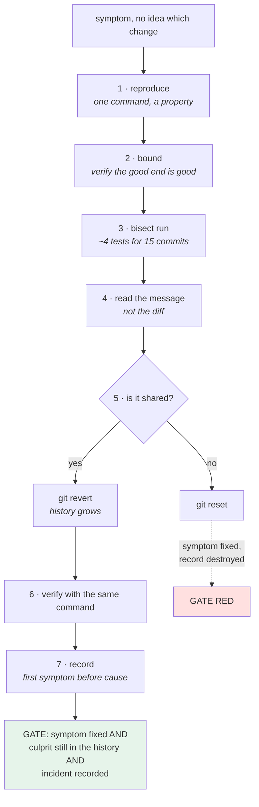

# 5.3 — The 2am drill: a regression, found from history alone

## One-line answer

The day's red gate: a symptom, no idea which change caused it, and a rule that you may not read the diffs —
**find the culprit, revert it safely, and write the record**, using only the history and the four commands
this day built.

---

## The story

🎬 **The scene.** A pilot on a night flight with a warning light, a checklist on a card, and no instructor.

The checklist does not tell her what is wrong. It tells her the order to find out in, and it exists because
somebody wrote it down calmly, in daylight, knowing that nobody thinks clearly at three in the morning at
altitude.

😬 **The naive fix.** A confident pilot who knows the aircraft skips the card and diagnoses from experience.
Nine times out of ten it is faster.

💥 **Why it fails.** On the tenth, the symptom is one she has not met, and without the card there is no
sequence — so she tries things. Each attempt changes the state, and by the fourth she is diagnosing a system
that is no longer the one that showed the original symptom.

**The card's value was never the knowledge.** It was that it stops you from acting before you have looked, and
that it produces a record of what you did.

💡 **The insight.** **A procedure is not for the case you understand.** It is for the case you do not, and its
real output is a sequence you can retrace — which is also what makes the postmortem possible.

---

## The idea in plain language

Everything in this day exists for one situation:

- something is broken;
- it worked before;
- you do not know which change did it;
- and it is late.

**The sequence, and which part of today each step comes from:**

```text
1. reproduce            a single command that shows the symptom
2. bound it             a known-good commit and a known-bad one           (3.3)
3. search               git bisect run                                    (3.3)
4. read the culprit     git show — the message, not just the diff         (2.1)
5. undo                 git revert, because it is shared                  (4.2)
6. verify               the same command from step 1, now passing
7. record               docs/INCIDENTS.md, first symptom before cause     (5.1)
```

**Steps 1 and 2 are the ones people skip**, and they are the ones the whole search depends on: a bisect with a
flaky reproduction returns a confident wrong answer
([3.3](../03-reading-history/3.3-bisect-binary-search-over-history.md)), and one with a "good" commit that was
never good walks to the beginning of history.

**Step 5 is where the day's judgement lands.** The commit is on a shared branch, so the answer is `revert` and
not `reset` ([4.2](../04-undo/4.2-revert-versus-reset.md)) — and the file contents would be identical either
way, which is what makes the wrong choice so easy.

**Step 7 is the one that is skipped at 2am and needed at 2pm**, when somebody asks what happened.

### The rule for this drill

**You may not read the diffs while searching.** You may run the reproduction, run the bisect, and read commit
*messages*. That constraint is artificial and it is the point: it forces the procedure rather than the
intuition, and it makes the day's argument about commit messages
([2.1](../02-the-message/2.1-what-a-commit-message-is-for.md)) land as a measurable cost.

---

## Why Kriya needs it

**Day 79's runbook** is this sequence, one per alert, written in daylight.

**Day 82's postmortem** is step 7 at full size, and it is only possible because steps 1–6 left a trail.

**Day 84's incident drills** are this exercise repeated against a real system rather than a scratch
repository.

**Day 19's rollback** is step 5 at the deployment level: an undo that goes forward and is recorded.

**Day 232's day-2 operations** is the same drill, six months later, against a system you set up and have
forgotten.

**And this is the seventh consecutive day** ending in a deliberate failure — Day 5's disk, Day 6's kill, Day
7's connections, Day 8's certificate, Day 9's credential, Day 10's deploy that never arrived, and today's
regression that no signal reported at all. **Today's is different in one way: there is no dashboard to be
green.** The only record is the history.

---

## The mechanism

**Set up the drill without looking at it.** The script builds a history containing one bad change at a
position it chooses; you find it.

```bash
# lab/setup_drill.sh - builds a repository with a regression somewhere in it.
set -u
BASE="${1:?usage: setup_drill.sh <directory>}"
SEED="${2:?usage: setup_drill.sh <directory> <seed>}"
rm -rf "$BASE"; mkdir -p "$BASE"

git init -q --bare "$BASE/origin.git"
git clone -q "$BASE/origin.git" "$BASE/work" && cd "$BASE/work"
git config user.email you@example.invalid && git config user.name You

cat > tickets.py <<'EOF'
PRIORITIES = ["low", "normal", "high"]


def route(subject: str) -> str:
    """Return the queue for a ticket. Empty subjects are refused upstream."""
    score = len(subject) % len(PRIORITIES)
    return PRIORITIES[score]
EOF
git add tickets.py && git commit -q -m "feat(router): add the priority router"

BAD=$(( (SEED % 9) + 3 ))
for n in $(seq 1 14); do
  if [ "$n" -eq "$BAD" ]; then
    sed -i 's/score = len(subject) % len(PRIORITIES)/score = len(subject) % (len(PRIORITIES) - 1)/' tickets.py
    git commit -q -am "refactor(router): simplify the score calculation"
  else
    printf '# note %s\n' "$n" >> tickets.py
    git commit -q -am "chore(router): housekeeping $n"
  fi
done
git push -q -u origin main
echo "history built: $(git rev-list --count HEAD) commits. The regression is in there somewhere."
```

**Line by line:**

- **Both arguments are required.** A defaulted seed would make the drill identical every time, which turns a
  search into a memory test.
- `BAD=$(( (SEED % 9) + 3 ))` places the bad commit somewhere between the 3rd and 11th of fourteen — **never
  first or last**, because either would make the bisect trivial.
- The regression is `len(PRIORITIES)` → `len(PRIORITIES) - 1`: `"high"` becomes unreachable. **Two characters**,
  and the message says `refactor(router): simplify the score calculation` — conventional, plausible, and
  silent about behaviour. This is
  [2.4](../02-the-message/2.4-one-change-per-commit.md)'s review-defeating shape, deliberately.
- The other thirteen commits are noise with honest messages.
- It is **pushed to a bare remote**, so the history is shared and step 5's `revert`-not-`reset` decision is
  real rather than hypothetical.

```bash
BASE=$(mktemp -d)/drill
bash days/day-011-version-control-for-operators/lab/setup_drill.sh "$BASE" "$$"
cd "$BASE/work" && git log --oneline | head -4
```

**Line by line:**

- `"$$"` is the shell's own process ID — **a seed you did not choose**, so the position is genuinely unknown
  to you.

```text
history built: 15 commits. The regression is in there somewhere.
9d2f8a1 chore(router): housekeeping 14
4c9a1f3 chore(router): housekeeping 13
7d2e8b1 chore(router): housekeeping 12
a91f0c2 chore(router): housekeeping 11
```

**Step 1 — reproduce.** One command, one symptom:

```bash
cd "$BASE/work"
cat > /tmp/repro.sh <<'EOF'
set -u
cd "$(git rev-parse --show-toplevel)"
python -c "
import sys
sys.path.insert(0, '.')
try:
    import importlib, tickets; importlib.reload(tickets)
except Exception:
    sys.exit(125)
seen = {tickets.route('x' * n) for n in range(1, 30)}
sys.exit(0 if 'high' in seen else 1)
"
EOF
bash /tmp/repro.sh; echo "symptom present: exit=$?  (1 means broken)"
```

**Line by line:**

- The check is *"can any subject ever be routed to `high`"* — **a property, not an example.** A test asserting
  one specific input might pass by luck at some commits; a property holds or does not.
- `importlib.reload` because `git bisect` replaces the file between runs within the same interpreter
  invocation — here each run is a fresh process, and the reload makes the script correct even if it is ever
  called twice.
- `sys.exit(125)` on any import failure — **the untestable case**
  ([3.3](../03-reading-history/3.3-bisect-binary-search-over-history.md)).
- `/tmp/repro.sh` lives **outside the repository**, because bisect checks out old commits and a tracked script
  would vanish.

```text
symptom present: exit=1  (1 means broken)
```

**Step 2 — bound it:**

```bash
cd "$BASE/work"
FIRST=$(git rev-list --max-parents=0 HEAD)
git stash list >/dev/null; git status --short
git switch -q --detach "$FIRST" && bash /tmp/repro.sh; echo "at the first commit: exit=$? (0 means it worked)"
git switch -q main
```

**Line by line:**

- **Verify the "good" end is actually good.** This is the step that makes the search valid, and it is the one
  people assume.
- `git status --short` first — **bisect refuses to check out over a dirty tree**, and finding that out now is
  better than mid-search.
- `git switch --detach` rather than `checkout`, so the detached state is deliberate
  ([1.3](../01-the-object-model/1.3-branches-and-head-are-just-pointers.md)).

```text
at the first commit: exit=0 (0 means it worked)
```

**Step 3 — search:**

```bash
cd "$BASE/work"
git bisect start
git bisect bad HEAD
git bisect good "$(git rev-list --max-parents=0 HEAD)"
git bisect run bash /tmp/repro.sh 2>&1 | tail -6
```

**Line by line:**

- Two facts in, one answer out. **About four tests for fifteen commits**
  ([3.3](../03-reading-history/3.3-bisect-binary-search-over-history.md)).
- `tail -6` keeps the verdict and drops the step-by-step output.

```text
running 'bash' '/tmp/repro.sh'
Bisecting: 0 revisions left to test after this (roughly 1 step)
2f8b1c0 is the first bad commit
commit 2f8b1c0e9d3a7546b2e8c1f0a9d3754b6e2a8c1f
    refactor(router): simplify the score calculation
 tickets.py | 2 +-
bisect found first bad commit
```

**Step 4 — read the culprit, message first:**

```bash
cd "$BASE/work"
CULPRIT=$(git rev-parse --short "$(git rev-parse refs/bisect/bad 2>/dev/null || echo HEAD)")
git bisect reset
echo "culprit: $CULPRIT"
git show --format='%h%n%an %ad%n%n%s%n%n%b' --no-patch "$CULPRIT" --date=short
git show --stat --format='' "$CULPRIT"
```

**Line by line:**

- `refs/bisect/bad` holds the answer while a bisect is in progress — **capture it before `git bisect reset`**,
  which removes bisect's refs along with everything else.
- **`git bisect reset` immediately after**, which is the step
  [3.3](../03-reading-history/3.3-bisect-binary-search-over-history.md) said people forget.
- `--no-patch` with a format string shows **the message and nothing else** — obeying the drill's rule, and
  reflecting what you actually want first: who, when, and what they said they were doing.
- `--stat` shows the shape of the change (one file, one line) **without the diff.**

```text
culprit: 2f8b1c0
2f8b1c0
You 2026-08-25

refactor(router): simplify the score calculation

 tickets.py | 2 +-
```

**A one-line change described as a simplification, with no body.** The message told you nothing about
behaviour — which is exactly the cost
[2.1](../02-the-message/2.1-what-a-commit-message-is-for.md) predicted, now measured: **you had to run a
fifteen-commit search because the message could not be searched.**

**Step 5 — undo, correctly:**

```bash
cd "$BASE/work"
git log --oneline origin/main | grep -c "$CULPRIT" && echo "→ the culprit is on the shared branch: revert, not reset"
git revert --no-edit "$CULPRIT"
git log --oneline -2
```

**Line by line:**

- **Check whether it is shared before choosing the undo.** `git log origin/main` asks what the remote has —
  the one question that decides between `revert` and `reset`
  ([4.1](../04-undo/4.1-the-four-undos.md)).
- `git revert` adds an inverse commit; the history grows and the mistake stays visible
  ([4.2](../04-undo/4.2-revert-versus-reset.md)).
- `--no-edit` here for brevity; **in real use, write the message** — what the symptom was and whether the
  change should return.

```text
1
→ the culprit is on the shared branch: revert, not reset
b7d2f1a Revert "refactor(router): simplify the score calculation"
9d2f8a1 chore(router): housekeeping 14
```

**Step 6 — verify:**

```bash
cd "$BASE/work"
bash /tmp/repro.sh; echo "symptom after the revert: exit=$? (0 means fixed)"
git push -q && echo "pushed as a fast-forward — no --force needed"
```

**Line by line:**

- **The same command as step 1.** A different check would not be a verification.
- The push succeeds with no flags, which is the mechanical evidence that `revert` was the right choice
  ([4.2](../04-undo/4.2-revert-versus-reset.md)).

```text
symptom after the revert: exit=0 (0 means fixed)
pushed as a fast-forward — no --force needed
```

**Step 7 — record:**

```bash
cd "$BASE/work"
cat > incident_row.md <<EOF
| 19 | 2026-08-25 | 11 | No ticket was ever routed to the "high" queue | $CULPRIT — \`len(PRIORITIES) - 1\` made the last priority unreachable | \`git bisect run\` over 15 commits, ~4 tests | reverted on main (b7d2f1a); router property test added | The commit message said "simplify the score calculation" and had no body, so \`--grep\` found nothing and a search was the only option. |
EOF
cat incident_row.md
```

**Line by line:**

- The **first symptom** comes first and is written in the language of the observation — *"no ticket was ever
  routed to high"* — not the cause. Day 1's rule
  ([Day 1, 2.3](../../../day-001-what-operations-actually-is/parts/02-the-repo-remembers/2.3-the-first-symptom-column.md)).
- The **method** is recorded (`git bisect`, four tests), because the next person wants to know how it was
  found, not only what it was.
- The last column is the **finding about the process rather than the code**: the commit message made the
  search necessary. **That is the row that changes behaviour**, and it is the one people leave out.
- The heredoc is **unquoted** here — `<<EOF`, not `<<'EOF'` — because `$CULPRIT` must expand. The backslashes
  escape the backticks that would otherwise run commands
  ([Day 10, 2.1](../../../day-010-environments-and-promotion/parts/02-promotion/2.1-build-once-promote-the-artifact.md)
  made the same choice for the same reason).

```text
| 19 | 2026-08-25 | 11 | No ticket was ever routed to the "high" queue | 2f8b1c0 — `len(PRIORITIES) - 1` made the last priority unreachable | `git bisect run` over 15 commits, ~4 tests | reverted on main (b7d2f1a); router property test added | The commit message said "simplify the score calculation" and had no body, so `--grep` found nothing and a search was the only option. |
```

### The gate

**The drill is the red gate**, and it has to be able to fail:

```bash
# lab/drill_gate.sh - did the drill actually work?
set -u
WORK="${1:?usage: drill_gate.sh <work-directory>}"
cd "$WORK"
FAIL=0

bash /tmp/repro.sh || { echo "GATE RED: the symptom is still present" >&2; FAIL=1; }
git log --oneline -20 | grep -q '^[0-9a-f]* Revert ' \
  || { echo "GATE RED: no revert commit in the recent history" >&2; FAIL=1; }
git log --oneline -20 | grep -q 'refactor(router): simplify' \
  || { echo "GATE RED: the culprit is missing from the history — was reset used?" >&2; FAIL=1; }
[ -f incident_row.md ] && grep -q '^| ' incident_row.md \
  || { echo "GATE RED: no incident row was written" >&2; FAIL=1; }
git status --short | grep -q . && { echo "GATE RED: the working tree is dirty" >&2; FAIL=1; }
git rev-parse --verify -q refs/bisect/bad >/dev/null \
  && { echo "GATE RED: a bisect is still in progress — run git bisect reset" >&2; FAIL=1; }

[ "$FAIL" -eq 0 ] || { echo "GATE RED" >&2; exit 1; }
echo "GATE GREEN: symptom fixed, culprit still in the history, incident recorded, tree clean"
```

**Line by line:**

- Six conditions, **each reported separately** and none exiting early — one run tells you everything wrong
  ([Day 10, 2.3](../../../day-010-environments-and-promotion/parts/02-promotion/2.3-the-promotion-gate.md)).
- **Condition three is the interesting one**: it checks that the *culprit is still in the history*, which
  fails if you used `reset` instead of `revert`. **The symptom would be fixed either way** — this is the only
  condition that distinguishes the correct undo from the incorrect one.
- Condition four requires the record, so "fixed it and moved on" is a red gate.
- Conditions five and six catch the two ways to leave the repository in a bad state: uncommitted changes, and
  an unfinished bisect ([3.3](../03-reading-history/3.3-bisect-binary-search-over-history.md)).
- `git rev-parse --verify -q` exits non-zero when the ref does not exist, which is the **wanted** case — hence
  the `&&` rather than `||`.

```bash
cd "$(git rev-parse --show-toplevel)"
echo '=== GREEN: after doing the drill properly ==='
bash days/day-011-version-control-for-operators/lab/drill_gate.sh "$BASE/work"; echo "exit=$?"

echo '=== RED: what reset would have produced ==='
( cd "$BASE/work" && git reset --hard -q HEAD~1 && git reset --hard -q "$CULPRIT~1" )
bash days/day-011-version-control-for-operators/lab/drill_gate.sh "$BASE/work"; echo "exit=$?"
```

**Line by line:**

- The green run first, then the red — and **the red is produced by choosing `reset`**, which is the mistake
  this whole section is about rather than an arbitrary breakage.
- `git reset --hard "$CULPRIT~1"` moves the branch to before the bad commit: **the symptom is gone and so is
  the record.**

```text
=== GREEN: after doing the drill properly ===
GATE GREEN: symptom fixed, culprit still in the history, incident recorded, tree clean
exit=0
=== RED: what reset would have produced ===
GATE RED: no revert commit in the recent history
GATE RED: the culprit is missing from the history — was reset used?
GATE RED: no incident row was written
GATE RED
exit=1
```

**The symptom is fixed in both cases.** Three of the six conditions fail anyway, and every one of them is
about the *record* rather than the code — which is the day's argument, mechanised.

Clean up:

```bash
cd /tmp && rm -rf "$BASE" /tmp/repro.sh
```

**Line by line:**

- Leave the scratch tree before deleting it, and remove the reproduction script from `/tmp` as well —
  it is the one artifact of this drill that lives outside the temporary directory, and a stale
  `repro.sh` would silently be used by the next run.



---

## When it breaks

**The bisect that ran on a dirty tree.** Step 2's check, skipped:

```text
$ git bisect start
error: cannot bisect: your local changes would be overwritten by checkout.
Please commit your changes or stash them before you bisect.
```

**What it says:** the working tree is dirty.
**What it actually means:** **git refused**, which is the good outcome — checking out historical commits over
uncommitted work would either lose it or produce a hybrid state
([1.2](../01-the-object-model/1.2-the-three-trees.md)).
**The smallest fix:** `git stash`, do the drill, `git stash pop`.
**Why the refusal is worth noticing:** it is one of the few places git protects the working tree by default,
and it is a reminder that everything else in section 4 does not.

**The revert that was actually a reset.** The undo that fixed the symptom and destroyed the record:

```text
$ git log --oneline -3
9d2f8a1 chore(router): housekeeping 14
4c9a1f3 chore(router): housekeeping 13
7d2e8b1 chore(router): housekeeping 12
$ bash /tmp/repro.sh; echo $?
0
```

**What it says:** the symptom is fixed and the history looks normal.
**What it actually means:** the branch was reset to before the culprit, so **fourteen commits' worth of
housekeeping went with it** and the bad commit is not in the history. The postmortem question *"when did this
ship"* is now unanswerable, and pushing this needs `--force`
([4.3](../04-undo/4.3-the-force-push-and-the-reflog.md)).
**The smallest fix:** `git reset --hard 'HEAD@{1}'` from the reflog, then revert properly
([1.4](../01-the-object-model/1.4-nothing-is-lost-the-object-database.md)).
**Why the gate checks for the culprit's presence:** it is the only condition that can tell these two apart, and
the symptom-level check cannot.

**The reproduction that was an example.** Step 1, done weakly:

```text
$ python -c "import tickets; assert tickets.route('hello') == 'high'"
Traceback (most recent call last):
AssertionError
$ # ...and at some commits it passes for the wrong reason
```

**What it says:** one input produces the wrong queue.
**What it actually means:** `route` is `len(subject) % n`, so **whether a specific string maps to `high`
depends on the modulus** — and at some historical commits the assertion passes by arithmetic coincidence.
Bisect gets a `good` that is not good and searches the wrong half.
**The smallest fix:** test the **property** — *"some input reaches `high`"* — which is what the drill's script
does.
**The general rule:** **a bisect's reproduction must be a property, not an example**, because an example can
be satisfied accidentally and a property cannot.

**The drill that was finished but not reset.** The forgotten step, again:

```text
$ git status
HEAD detached at 2f8b1c0
You are currently bisecting, started at main.
$ # ...and every later command behaves strangely
```

**What it says:** a bisect is still in progress.
**What it actually means:** the answer was found and `git bisect reset` was never run, so the repository is on
a historical commit with bisect's refs still present. **The revert you then make lands on a detached HEAD and
belongs to no branch** ([1.3](../01-the-object-model/1.3-branches-and-head-are-just-pointers.md)) — so it looks
done and is not.
**The smallest fix:** `git bisect reset`, then find your revert with `git reflog` and cherry-pick it.
**Why the gate checks for it:** it is invisible in a normal `git log` and it is the single most common way a
drill produces work that is not on any branch.

---

## In production

**What a professional writes instead of the teaching version.** The sequence lives in a **runbook**, one per
alert (Day 79), with the reproduction command written in advance — because the hardest step at 2am is step 1,
and writing it calmly beforehand is most of the value. They also do step 5 *first* when the impact is
ongoing: revert, then investigate, because a revert gets harder as commits land on top of it
([4.2](../04-undo/4.2-revert-versus-reset.md)) and the users do not benefit from your diagnosis.

**What degrades at scale.** The cost per bisect step, and the number of candidate changes. Fifteen commits and
an instant test is a drill; ten thousand commits with a test that needs a container build is most of a day —
and the counter-measure is not a faster bisect, it is **not needing one**: if CI runs the relevant check on
every commit (Day 13), the first failing commit is a matter of record. **A team that bisects often has a gap
in its pipeline**, and Day 20's change failure rate is where that shows up as a number.

**The failure that only shows with real traffic.** A regression that the reproduction cannot express. Today's
symptom is deterministic and local; the ones that actually happen are a percentage of requests, a latency
tail, a memory growth over days
([Day 10, 3.3](../../../day-010-environments-and-promotion/parts/03-what-production-promises/3.3-the-staging-environment-that-lied.md)).
**A bisect needs a test that answers in seconds and those symptoms do not.** That is why the production answer
moves to per-version comparison — error rate by build (Day 41), which identifies a bad release by comparison
rather than by search.

**The review comment a senior engineer leaves.** *"The incident row says what the bug was and not how it was
found. Add the method — bisect over fifteen commits — and add the finding about the commit message, because
that is the thing that made a search necessary and it is the only part of this that changes anybody's
behaviour. Also, please write the reproduction into the runbook while you still remember it."*

**The signal you would alert on.** This drill is what happens **after** a signal fired, and the honest
observation is that today's symptom would have produced **no signal at all**: no error, no latency change, no
log line — just a queue nobody was routed to. **That is the whole argument for Phase 7 and Phase 8**, and the
specific signal that would have caught it is a business-level one: *"tickets routed per priority, per hour"*,
where a category going to zero is the alert (Day 75's service level indicators). The two mechanical signals
worth having from *this* part are the ones from
[5.1](5.1-the-repository-is-the-incident-record.md): **revert commits per week** (Day 20's change failure
rate) and **the incident ledger's staleness**.

**Blast radius.** This part builds a bare remote and a clone under `mktemp -d`, runs `bisect` (which checks
out arbitrary historical commits), `revert`, `reset --hard` and a push, and deletes everything at the end.
Nothing touches the Kriya repository and no network is used. **The gate's red case deliberately performs the
destructive undo** — a `reset --hard` that discards fourteen commits — inside that scratch clone, which is the
only place in this curriculum where that is demonstrated on a shared branch. What bounds it: the scratch
repositories, and the gate itself, which refuses precisely because the record was destroyed. Who can trigger
it: you. **Do not run the drill in the Kriya repository**, and note that the setup script takes a directory
argument specifically so that it cannot be run in place.

**Cost.** `0` model calls, `0` tokens, `0` CI minutes, `0` new packages, `0` network (the remote is a local
path), `0` servers. Disk: two small repositories, deleted. RAM: negligible. **CPU: about four checkouts and
four test runs**, instant here and the number to think about on a real repository.

**The interview question.** *"Walk me through finding and fixing a regression when you do not know which change
caused it."* The answer that is a procedure rather than a story: *"Reproduce it with one command first — and
make it a property rather than an example, because an example can pass by coincidence at some commits and
that sends a bisect down the wrong half. Then bound it: a known-bad commit and a known-good one, and I
actually verify the good end rather than assuming. Then `git bisect run` with that script, which is about
log₂(n) tests and exits 125 for commits that cannot be tested. When it lands, I read the commit message before
the diff, because the message is what tells me whether the change should come back. Then the undo — `revert`,
not `reset`, because it is on a shared branch, and the check for that is one `git log origin/main`. Then I run
the same reproduction to verify, and I write the incident row with the first symptom before the cause and the
method used. The step people skip is the last one, and the field that matters most in it is what made the
search necessary — in the case I have in mind, a commit message that said 'simplify' and had no body."*

---

## Check yourself

```bash
KRIYA=$(git rev-parse --show-toplevel)
LAB="$KRIYA/days/day-011-version-control-for-operators/lab"
B=$(mktemp -d)/d
bash "$LAB/setup_drill.sh" "$B" "$$"
# steps 1-7 are yours, in "$B/work". then:
bash "$LAB/drill_gate.sh" "$B/work" ; echo "exit=$?"
cd /tmp && rm -rf "$B" /tmp/repro.sh
```

**The gate must go green** — and it must have gone red at least once first, produced by using `reset` instead
of `revert`. **A gate you have only seen pass is not a gate.**

**Say out loud, without scrolling up:** *Give the seven steps in order, say which two people skip and what
each one's omission costs, and explain why the gate checks that the culprit is still in the history rather
than only that the symptom is gone.*
